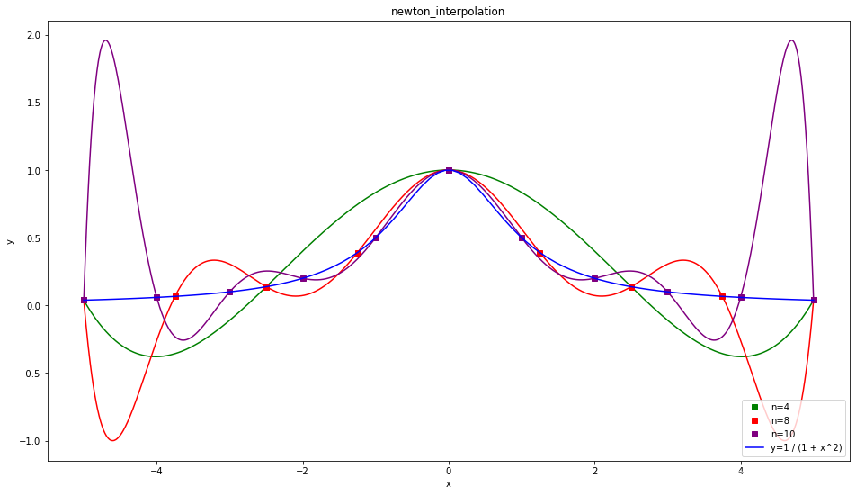
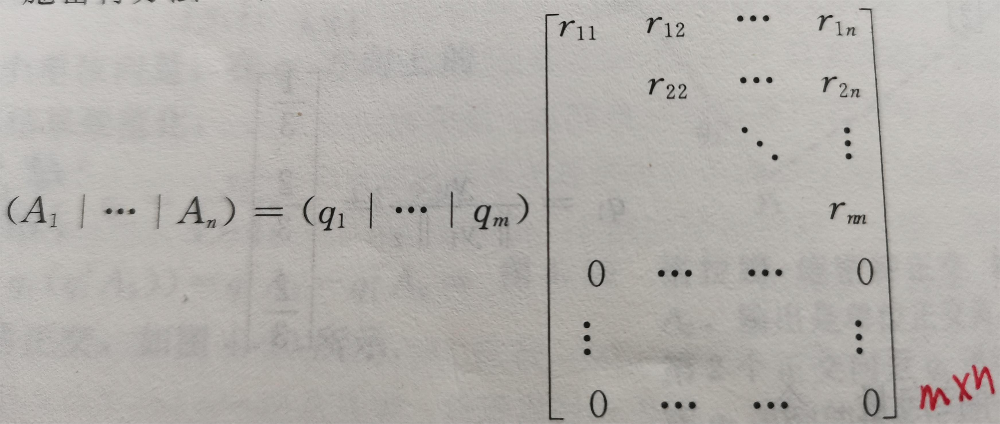
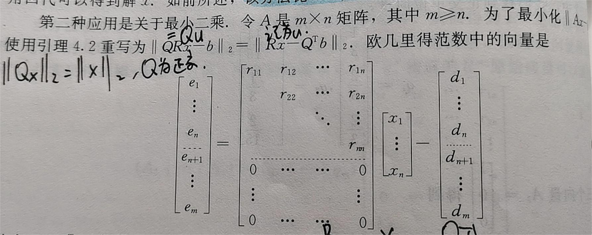
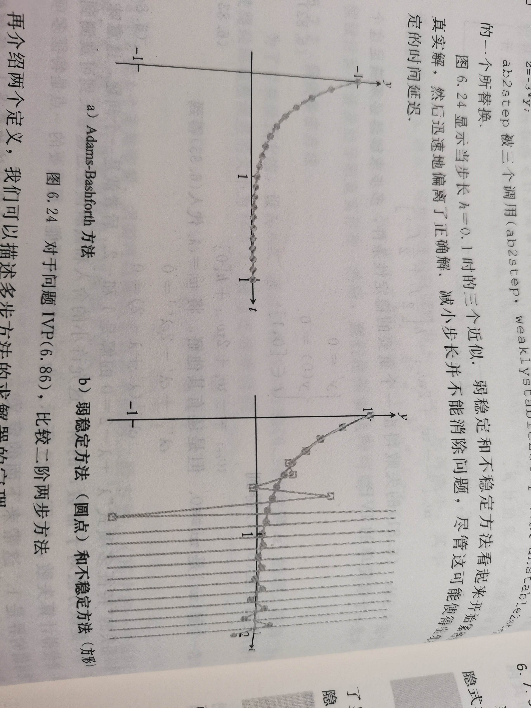

# 数值分析学习笔记（上）

## Chap0 基础知识

> 重点研究现代计算机运行机器算数的细节，并讨论因设计较差带来的有效数字缺失问题。

### 重点1 多项式求值的嵌套乘法

$$
\text{标准形式：}c_1+c_2x+c_3x^2+c_4x^3+c_5x^4
\\
\text{嵌套形式：}c_0+\left( x-r_1 \right) \left( c_2+\left( x-r_2 \right) \right) \left( c_3+\left( x-r_3 \right) \right) \left( c_4+\left( x-r_4 \right) c_5 \right)
$$

将标准形式的多项式从前向后写，关于x的幂被分解为与余下多项式的乘积。

好处：一般的d阶多项式可以通过**d次乘法**和**d次加法**求值；显著减少运算次数


### 重点2 二进制与计算误差

 计算机的微小误差会使得计算面临不可靠的风险

|       精度       | 符号 | 指数 | 尾数 |
| :--------------: | :--: | :--: | :--: |
|  单精度(4byte)   |  1   |  8   |  23  |
|  双精度(8byte)   |  1   |  11  |  52  |
| 长双精度(10byte) |  1   |  15  |  64  |

|    类型     | 比特（位）数 | 有效数字 |         数值范围          |
| :---------: | :----------: | :------: | :-----------------------: |
|    float    |      32      |   6~7    |  -3.4*10^38～+3.4*10^38   |
|   double    |      64      |  15~16   |  -1.7*10^-308~1.7*10^308  |
| long double |     128      |  18~19   | -1.2*10^-4932~1.2*10^4932 |

标准形式的IEEE浮点数（这里是二进制数，只有0和1）：
$$
\pm 1.bbb...\times 2^p
$$
大量C编译器和MATLAB对双精度的处理是指数11bit(p),尾数52bit(b)
$$
1\text{的双精度表示：}+1.00000000000000000000000000000000000000000000000000\times 2^0
\\
\text{下一个比}1\text{大的浮点数：}+1.00000000000000000000000000000000000000000000000001\times 2^0
$$
于是，记$
\varepsilon _{mach}=2^{-52}
$为机器精度。

通过简单丢弃在末端之外的数位实现截断（用有穷数位表示无穷数位）

“相对于500，512是更整的数字”


==重要概念：误差==

$绝对误差=|x_c-x|$

$相对误差=\frac{|x_c-x|}{|x|}$


### 重点3 有效数字的缺失

本节重点：

1. 尽量避免把两个近似相等的数字相减

2. 避免分母相对分子非常小的除法

   

### 重点4 积分均值定理

$令f是[a,\ b]上的连续函数，\ 令g是一个可积分函数，并且在[a,\ b]上不改变符号，则在a和b间存在数字c使得：$
$$
\int_a^b{f\left( x \right) g\left( x \right) dx=f\left( c \right) \int_a^b{g\left( x \right) dx}}
$$


## Chap1 求解方程

> 研究单变量方程的求解方法

### 重点1 二分法

原理：记$x_c为二分解，r为真实解$
$$
\text{令}f\text{是区间}\left[ a, b \right] \text{的连续函数，满足}f\left( a \right) f\left( b \right) <0,\text{则}f\text{在}a\text{和}b\text{之间存在一个根。}
$$

$$
\text{求解误差}=|x_c-r|<\frac{b-a}{2^{n+1}}
$$


### 重点2 不动点迭代

定义：
$$
\text{当}g\left( r \right) =r,\text{实数}r\text{是函数}g\text{的不动点}
$$
迭代流程：
$$
x_0=\text{初始估计}
\\
x_{i+1}=g\left( x_i \right) , i=0,1,2...
$$

==重要定义：线性收敛==
$$
\text{令}e_i\text{表示迭代过程第}i\text{步的误差，如果}\lim_{t\rightarrow \infty} \frac{e_{i+1}}{e_i}=S<1
\\
\text{该方法被称为线性收敛，收敛速度为}S
$$


==重要定义：局部收敛==

如果迭代方法对于一个足够接近r的初值能够收敛到r，该迭代方法称为局部收敛到r.


### 重点3 精度的极限

案例：使用二分法求解函数$
f\left( x \right) =x^3-2x^2+\frac{4}{3}x-\frac{8}{27}
$在[0, 1]的根

笔算立即得到，根为$x=\frac{2}{3}$

但二分法在计算16次后停止，解为0.666 664 1

如果考虑6位或更多的精度，计算误差是非常严重的

原因出在$f(0.666 664 1)=-1.1102230246251565e-16$，符合计算机对根的定义

**在y轴上近似解足够接近真实解，但在x轴上并不接近**


==重要定义：前向误差与后向误差==
$$
\text{假设}f\text{是一个函数，}r\text{是一个根，意味着满足}f\left( r \right) =0.\text{假设}x_a\text{是}r\text{的近似根。}
\\
\text{近似}x_a\text{的后向误差是}|f\left( x_a \right) |,\text{前向误差是}|r-x_a|
$$


上面这个例子问题在于，后向误差很小，但前向误差很大。


### 重点4 根搜索的敏感性

> 量化误差，并引入误差放大因子和条件数概念。


假设问题是找到$f(x)=0$的根*r*,但对输入做了一个小的变化$\varepsilon g(x),\varepsilon\rightarrow0$,令$\Delta r$为对应根的变化，有：
$$
f\left( r+\Delta r \right) +\varepsilon g\left( r+\Delta r \right) =0
$$
将$f$和$g$分别展开为一阶泰勒多项式
$$
f\left( r \right) +\left( \Delta r \right) f^{\prime}\left( r \right) +\varepsilon g\left( r \right) +\varepsilon \left( \Delta r \right) g^{\prime}\left( r \right) +O\left( \left( \Delta r^2 \right) \right) =0
$$
忽略高阶余项，并考虑到$f(r)=0$
$$
\left( \Delta r \right) \left( f^{\prime}\left( r \right) +\varepsilon g^{\prime}\left( r \right) \right) \approx -f\left( r \right) -\varepsilon g\left( r \right) =-\varepsilon g\left( r \right)
$$
变形：
$$
\Delta r\approx \frac{-\varepsilon g\left( r \right)}{f^{\prime}\left( r \right) +\varepsilon g^{\prime}\left( r \right)}\approx -\varepsilon \frac{g\left( r \right)}{f^{\prime}\left( r \right)}
$$
$\text{假设和}f^{\prime}\left( r \right) \text{相比，}\varepsilon \text{很小，并且}f^{\prime}\left( r \right) \ne 0.$

于是得到根的敏感公式：
$$
\text{假设}r\text{是函数}f\left( x \right) \text{的根，并且}r+\Delta r\text{是}f\left( x \right) +\varepsilon g\left( x \right) \text{的根，则当}\varepsilon \ll f^{\prime}\left( r \right) ,
\\
\Delta r\approx -\frac{\varepsilon g\left( r \right)}{f^{\prime}\left( r \right)}
$$


==重要概念：误差放大因子==（*相对后向误差这里有点怪？*）
$$
\text{误差放大因子}=\frac{\text{相对前向误差}}{\text{相对后向误差}}=|\frac{\Delta r/r}{\varepsilon g\left( r \right) /g\left( r \right)}|=\frac{|g\left( r \right) |}{|rf^{\prime}\left( r \right) |}
$$
这个概念的重要性在于，描述操作精度会有输入和输出多少位损失

例如，放大因子数量级为10^12,就会损失12位有效数字


==重要概念：条件数==

条件数定义为所有输入变化，或者至少规定类型的变化造成的最大误差放大。

条件数高的问题称为病态问题；在1附近则称为良态问题。

这里注意：条件数仅仅度量问题本身带来的误差放大

**条件数**指理论问题**本身带来的误差放大部分**，和算法无关

**稳定**，指的是由于**算法小的输入误差造成的放大**，而不是问题本身。

如果一个算法在小的后向误差存在时，总能给出一个近似解，则称算法是稳定的


### 重点5 牛顿法和拟牛顿法

#### 牛顿法

$$
x_0=\text{初始估计}
\\
x_{i+1}=x_i-\frac{f\left( x_i \right)}{f^{\prime}\left( x_i \right)}
$$


==重要概念：二次收敛==
$$
\text{令}e_i\text{表示一个迭代方法第}i\text{步后得到的误差，该迭代是二次收敛，如果满足：}
\\
M=\underset{i\rightarrow \infty}{\lim}\frac{e_{i+1}}{{e_i}^2}<\infty
$$

$$
\text{令}f\text{是二阶连续可微函数，}f\left( r \right) =0. \text{如果}f^{\prime}\left( r \right) \ne 0,\text{则牛顿方法局部二次收敛到}r.
\\
\text{第}i\text{步的误差}e_i\text{满足}\underset{i\rightarrow \infty}{\lim}\frac{e_{i+1}}{{e_i}^2}=M=\frac{f^{''}\left( r \right)}{2f^{\prime}\left( r \right)}
$$


牛顿法也不总是二次收敛，比如在$f^{\prime}\left( r \right) = 0$的情况

用牛顿法找到$f(x)=x^2$的根就是线性收敛的

此时牛顿法被简化为：$x_{i+1}=\frac{x_i}{2}$, 收敛速度和常数$\frac{1}{2}$成比例


#### 割线方法

$$
x_0,x_1=\text{初始估计}
\\
x_{i+1}=x_i-\frac{f\left( x_i \right) \left( x_i-x_{i-1} \right)}{f\left( x_i \right) -f\left( x_{i-1} \right)}
$$
割线方法以超线性的速度收敛到一个单根（线性法和二次收敛之间）


## Chap2 方程组

> 研究同时求解多个多变量方程

### 重点1 高斯消去法

最常见的计算方法

矩阵行变换，转为上三角矩阵，回代求解。

==操作次数==：消去的开销显著大于回代开销

$n个方程n个未知数的消去计算，可以在\frac{2}{3}n^3+\frac{1}{2}n^2-\frac{6}{7}n次操作后完成$

$n个方程n个未知数的回代计算，可以在n^2次操作后完成$


### 重点2 LU分解

LU分解时高斯消去法的矩阵形式


### 重点3 误差来源

> 线性方程组系统的误差研究


* 定义

$
\text{向量}x=\left( x_1,...,x_n \right) \text{无穷范数}\left\| x \right\| _{\infty}=\max |x_i|
$

$
\text{令}x_a\text{是线性方程组}Ax=b\text{的近似解。余项是}r=b-Ax_a,\text{后向误差是余项的范数}\left\| b-Ax_a \right\| _{\infty}, \text{前向误差是}\left\| x-x_a \right\| _{\infty}
$

$
\text{相对后向误差}=\frac{\left\| r \right\| _{\infty}}{\left\| b \right\| _{\infty}},\text{相对前向误差}=\frac{\left\| x-x_a \right\| _{\infty}}{\left\| x \right\| _{\infty}}
$


==重要概念：条件==

对于方程$f(x)=0$的求解，考虑求根过程中的误差放大因子；

同理对于矩阵方程$Ax=b$，也有类似的误差放大因子

最大可能的放大因子是$cond(A)=\left\|A\right\|\left\|A^{-1}\right\|$

**条件数有助于诊断病态问题是否出现**


#### 淹没(swamp)

例 考虑方程组
$$
10^{-20}x_1+x_2=1
\\
x_1+2x_2=4
$$
根据高斯消元法，得到精确解
$$
\left[ x_1, x_2 \right] =\left[ \frac{2\times 10^{20}}{10^{20}-2},\frac{4-10^{20}}{2-10^{20}} \right] \approx \left[ 2, 1 \right]
$$
计算机版本进行高斯消去：

$$
\left[ \begin{matrix}
	10^{-20}&		1\\
	0&		2-10^{20}\\
\end{matrix} \right] x=\left[ \begin{array}{c}
	1\\
	4-10^{20}\\
\end{array} \right]
$$
得到计算解$[x_1, x_2]=[0, 1]$

问题在于消去过程中乘子$10^{20}$,底部方程被抑制


于是考虑对高斯消去法进行修改，每次消去之前，找到第一列中最大的元素，其对应行进行交换（部分主元法）

矩阵形式，称为PA=LU分解


### 重点4 迭代方法

#### **迭代方法**

$其中，D表示矩阵A的主对角线矩阵，L表示矩阵A的下三角矩阵（主对角线以下的元素），U表示矩阵A的上三角矩阵.$

**雅可比方法**
$$
x_0=\text{初始向量}
\\
x_{k+1}=D^{-1}\left( b-\left( L+U \right) x_k \right) , k=0,1,2,...
$$


* **高斯-赛德尔方法**

$$
x_0=\text{初始向量}
\\
x_{k+1}=D^{-1}\left( b-Ux_k-Lx_{k+1} \right) , k=0,1,2,...
$$


* **连续过松弛(SOR)**

$$
x_0=\text{初始向量}
\\
x_{k+1}=\left( wL+D \right) ^{-1}\left[ \left( 1-w \right) Dx_k-wUx_k \right] +w\left( D+wL \right) ^{-1}b, k=0,1,2,...
$$

> 数字$w$被称为松弛参数，当$w>1$时被称为过松弛。
>
> 当$w=1$，SOR就是高斯-赛德尔方法。


#### **迭代收敛**

**严格对角占优矩阵**：$n\times n\text{的矩阵}A=\left( a_{ij} \right) \text{是严格对角占优矩阵，要求对于每个}1\le i\le n,|a_{ii}|>\sum_{i\ne j}{|a_{ij}|.}$

实际上，严格对角占优方阵是**非奇异**的。

$
\text{假设}|A|=0,\text{则}Ax=0\text{存在非零解，记为}x=\left( x_1,x_{2,}...x_n \right) 
$

$
|x_k|=\max \left\{ |x_1|,|x_2|,...|x_n| \right\} ,\text{则}|x_k|>0
$
$$
\text{由假设}Ax=0\text{存在非零解},\sum_{j=1}^n{a_{kj}x_j=0}.
\\
\left| \sum_{j\ne k}^n{a_{kj}x_j} \right|=|-a_{kk}x_k|=|a_{kk}||x_k|
$$
$又A为严格对角占优矩阵：$
$$
|a_{kk}||x_k|>\left| \sum_{j\ne k}{a_k} \right||x_j|\ge \left| \sum_{j\ne k}^n{a_{kj}x_j} \right|
$$
$出现矛盾，故detA\ne0.$


矩阵的**谱**或叫矩阵的**谱半径**，在特征值估计、广义逆矩阵、数值分析以及数值代数等理论的建树中，都占有极其重要的地位；矩阵的谱半径为矩阵的特征值的模的最大值。
$$
\rho \left( A \right) =\max _{1\le i\le n}\left\{ |\lambda _i| \right\}
$$
关于矩阵的谱（半径）的一个重要性质即是：任意复数域上的矩阵的谱半径不大于其任意一种诱导范数。


课本直接给出以下**谱半径与迭代过程收敛**的定理：

如果$n\times n$矩阵$A$具有谱半径$\rho(A)<1$,$b$为任意向量，则对于任意向量$x_0$,迭代过程$x_{k+1}=Ax_k+b$收敛。

我们如果能够证明谱半径$\rho(D^{-1}(L+U))<1$，即可证明雅可比方法对于严格对角矩阵收敛。（同理：高斯-赛德尔方法）

证明如下：

$
\text{记}B_J=-D^{-1}\left( L+U \right) =I-D^{-1}A\left( A=D+U+L \right) 
$

$
\text{即证}\rho \left( B_J \right) =\rho \left( -D^{-1}\left( L+U \right) \right) =\max \left\{ |\lambda _i| \right\} <1, \lambda _i\text{为}|-D^{-1}\left( L+U \right) |\text{特征值}
$

$
\text{采用反证：假设}D^{-1}\left( L+U \right) \text{的某个特征值}|\lambda |\ge 1.$
$$
\det \left( D^{-1} \right) \det \left( D-\lambda ^{-1}\left( L+U \right) \right) =0
\\
\det \left( D-\lambda ^{-1}\left( L+U \right) \right) =0
\\
\text{由于}A\text{严格对角占优：}
\\
|a_{ii}|>\sum_{j\ne i}{|a_{ij}|}>\sum_{j\ne i}{|\lambda ^{-1}|}\cdot |a_{ij}|, \left( |\lambda |\ge 1 \right)
$$
$
\text{放缩得到了，}D-\lambda ^{-1}\left( L+U \right) \text{也是严格对角占优矩阵}
$

$
\text{但}D-\lambda ^{-1}\left( L+U \right) \text{行列式为}0\text{，与严格对角占优矩阵非奇异矛盾。}
$


**雅可比**和**高斯-赛德尔**方法对于**严格对角占优矩阵**收敛。

### 重点5 对称正定矩阵的处理方法

> 使用楚列斯基分解方法，将所有的对称正定矩阵分解为$A=R^TR$,其中$R$为上三角矩阵。

证明思路：运用数学归纳法，递推证明

```
for k=1,2,...,n
	if A[k][k] < 0, stop, end
	R[k][k]=sqrt(A[k][k])
	u.T = 1/R[k][k]*A[k][k+1: n]
	R[k][k+1: n] = u.T
	A[k+1:n][K+1:n] = A[k+1:n][k+1:n]-u*u.T
end
```


### 重点6 共轭梯度方法

> 共轭梯度法和高斯消去法都是直接求解法
>
> 被看作迭代方法的原因在于**每次计算都能给出一个近似解**。
>
> 求解过程也会受到病态矩阵问题影响，可以通过预条件进行改善。

```
x0=初始估计
d0=r0=b-Ax0
for k=0,1,2...,n-1
	if r[k]=0, stop, end
	alpha[k]=r[k].T*r[k]/(d[k].T*A*d[k])
	x[k+1]=x[k]+alpha[k]*d[k]
	r[k+1]=r[k]-alpha[k]*A*d[k]
	beta[k]=r[k+1].T*r[k+1]/(r[k].T*r[k])
	d[k+1]=r[k+1]+beta[k]*d[k]
end
```


### 重点7 非线性方程组

$DF$为Jacobi矩阵

对于多变量非线性问题，牛顿迭代法如下（通过泰勒展开证明）：
$$
x_0=\text{初始向量}
\\
x_{k+1}=x_k-\left( DF\left( x_k \right) \right) ^{-1}F\left( x_k \right) , k=0,1,2...
$$
类似，提出了在没有导数和导数难以计算的情况下的割线方法：**Broyden方法**

```
x0=初始估计
A0=初始矩阵
for i=0,1,2...
	x[i+1]=x[i]-inv(A[i])*F(x[i])
	A[i+1]=A[i]+(Delta[i+1]-A[i]*delta[i+1])*delta[i+1].T
end
其中delta[i+1]=x[i+1]-x[i], Delta[i+1]=F(x[i+1])-F(x[i])
```


## Chap3 插值

> 多项式插值和样条插值是非常便利的工具，通过它们可以找出经过给定点的所有点的函数。

### 重点1 插值函数

#### 拉格朗日插值多项式

拉格朗日法非常直观，但计算效率很低。


假设我们有$n$个点$(x_1, y_1),...(x_n, y_n)$,对于1~n之间的每个$k$, 定义：
$$
L_k\left( x \right) =\frac{\left( x-x_1 \right) \cdots \left( x-x_{k-1} \right) \left( x-x_{k+1} \right) \cdots \left( x-x_n \right)}{\left( x_k-x_1 \right) \cdots \left( x_k-x_{k-1} \right) \left( x_k-x_{k+1} \right) \cdots \left( x_k-x_n \right)}
$$
$L_k$显然具备性质：$L_k(x_k)=1,L_k(x_j)=0,其中j是任一其他数据点$

然后定义拉格朗日多项式：
$$
P_{n-1}\left( x \right) =y_1L_1\left( x \right) +\cdots +y_nL_n\left( x \right)
$$
可以证明：给定$n$个点$(x_1, y_1),...(x_n, y_n)$，具备不同的$x_i$坐标，则存在唯一一个$n-1$次或者更低次的多项式$P$满足:
$$
P(x_i)=y_i,i=1,2,...n
$$


#### 牛顿差商

> 和拉格朗日插值多项式本质是一样的，仅仅是以不同的形式写出来。


首先定义**差商**：$用f[x_1,...x_n]表示（唯一）多项式的x^{n-1}项系数，该多项式插值((x_1,f(x_1)),...,(x_n,f(x_n))).$

并给出**牛顿差商公式**：
$$
P\left( x \right) =f\left[ x_1 \right] +f\left[ x_1\,\,x_2 \right] \left( x-x_1 \right) +f\left[ x_1\,\,x_2\,\,x_3 \right] \left( x-x_1 \right) \left( x-x_2 \right) +\cdots +f\left[ x_1\cdots x_n \right] \left( x-x_1 \right) \cdots \left( x-x_{n-1} \right)
$$
差商是递归定义的：
$$
f\left[ x_k \right] =f\left( x_k \right) 
\\
f\left[ x_k\,\,x_{k+1} \right] =\frac{f\left[ x_{k+1} \right] -f\left[ x_k \right]}{x_{k+1}-x_k}
\\
f\left[ x_k\,\,x_{k+1}\,\,x_{k+2} \right] =\frac{f\left[ x_{k+1}\,\,x_{k+2} \right] -f\left[ x_k\,\,x_{k+1} \right]}{x_{k+2}-x_k}
\\
f\left[ x_k\,\,x_{k+1}\,\,x_{k+2}\,\,x_{k+3} \right] =\frac{f\left[ x_{k+1}\,\,x_{k+2}\,\,x_{k+3} \right] -f\left[ x_k\,\,x_{k+1}\,\,x_{k+2} \right]}{x_{k+3}-x_k}
\\
...
$$


### 重点2 插值误差

==估计误差的核心定理==

$
\text{假设}P\left( x \right) \text{是}n-1\text{或者更低阶的插值多项式，其拟合}n\text{个点}\left( x_1,y_1 \right) ,...,\left( x_n,y_n \right) ,\text{插值误差满足：}
$
$$
f\left( x \right) -P\left( x \right) =\frac{\left( x-x_1 \right) \left( x-x_2 \right) \cdots \left( x-x_n \right)}{n!}f^{\left( n \right)}\left( c \right)
$$
$其中c在最小的数字和最大的n+1个数字x,x_1,...x_n之间.$


#### 龙格现象



多项式虽然可以拟合任意数据点集，但却更倾向于某些形状。

龙格现象的例子在数据端点外有非常大的误差


### 重点3 切比雪夫插值

通常，我们使用平均分布的点作为插值多项式的基点，但其实有更优选择，**提高对插值误差最大值的控制**。

==切比雪夫插值==

从重点2中的插值误差出发：
$$
f\left( x \right) -P\left( x \right) =\frac{\left( x-x_1 \right) \left( x-x_2 \right) \cdots \left( x-x_n \right)}{n!}f^{\left( n \right)}\left( c \right)
$$
尝试控制分子$\left( x-x_1 \right) \left( x-x_2 \right) \cdots \left( x-x_n \right)$尽量小，从而控制误差估计效果。

*考虑这个关于x的n次多项式在区间[-1, 1]上具有极值,是否在区间内能找到特定的$x_1,...,x_n$使得这个多项式最大值足够小?*


首先，定义切比雪夫多项式：
$$
T_n\left( x \right) =\cos \left( n\,\,\mathrm{arc}\cos x \right)
$$
根据余弦求和公式$cos(A+B)=cosAcosB-sinAsinB$, 推理得到:
$$
T_{n+1}\left( x \right) =2xT_n\left( x \right) -T_{n-1}\left( x \right)
$$
显然，前两项非常容易计算：$T_0(x)=1, T_1(x)=x.$


**这个定理给出了特定的回答了上面的问题**

选择实数$-1\le x_1,...,x_n\le 1$,使得下式尽可能小：
$$
\underset{-1\le x\le 1}{\max}\left| \left( x-x_1 \right) \cdots \left( x-x_n \right) \right|
$$
则
$$
x_i=\cos \frac{\left( 2i-1 \right) \pi}{2n}，对应多项式最小值为1/2^{n-1}
$$
实际上，这些点是**圆周上均匀分布的x坐标**


对这个结论进行拉伸平移变换得到：

$在区间[a, b],如果满足x_i=\frac{a+b}{2}+\frac{a-b}{2}\cos \frac{\left( 2i-1 \right) \pi}{2n}, i=1,2...n，则有估计：$
$$
\left| \left( x-x_1 \right) \cdots \left( x-x_n \right) \right|\le \frac{\left( \frac{b-a}{2} \right) ^n}{2^{n-1}},\text{在}\left[ a, b \right] \text{成立}
$$


### 重点4 三次样条

> 样条是另一种数据插值方式，**多项式插值**中，多项式给出**单一公式**满足所有数据点。
>
> **样条**使用**多个公式**，其中每个都是低阶多项式，来通过所有数据点。

显然，最简单的方式是线性样条，把相邻点连接起来即可。但线性样条存在缺乏平滑性的问题。

考虑三次样条（两个数据点间使用三阶多项式替换线性函数）：
$$
S_1\left( x \right) =y_1+b_1\left( x-x_1 \right) +c_1\left( x-x_1 \right) ^2+d_1\left( x-x_1 \right) ^3\text{在区间}\left[ x_1, x_2 \right] \text{上}
\\
...
\\
S_{n-1}\left( x \right) =y_{n-1}+b_{n-1}\left( x-x_{n-1} \right) +c_{n-1}\left( x-x_1 \right) ^2+d_{n-1}\left( x-x_{n-1} \right) ^3\text{在区间}\left[ x_{n-1}, x_n \right] \text{上}
$$


三次样条插值存在以下天然约束：

1. $S_i\left( x_i \right) =y_i, S_i\left( x_{i+1} \right) =y_{i+1}, where\ i=1,...,n-1$
2. ${S_{i-1}}^{\prime}\left( x_i \right) ={S_i}^{\prime}\left( x_i \right) , where\ i=2,...,n-1$
3. ${S_{i-1}}^{\prime\prime}\left( x_i \right) ={S_i}^{\prime\prime}\left( x_i \right), where\ i=2,...,n-1$

* 约束1：要求样条插值数据点

* 约束2：要求相邻样条连接处斜率相等
* 约束3：要求两条样条连接处曲率相等

这些约束为我们提供了$(n-1)+(n-2)+(n-2)=3n-5$个方程。

考虑到有$n$个点需要插值，需要$n-1$个三次函数，三次函数中需要确定$b_i,\ c_i, \ d_i$这三个参数，也就是说需要求$3n-3$个参数。


这两个欠缺的条件，通过手动添加约束条件的方法来填补。

列举一个最常见的约束（边界）条件：

* 自然样条 ${S^{''}}_1\left( x_1 \right) =0, {S^{''}}_{n-1}\left( x_n \right) =0$


通过一些处理可以使三次样条插值算法在计算机上高效运行。

这方面的代码很成熟，python和matlab都可以**非常方便**的进行不同需求的**三次样条插值**。


## Chap4 最小二乘

解决方程数量比未知量多的问题，找到一个与解最相似的向量。

### 重点1 法线方程的推导

实际上，任何$m\times n$的方程组$Ax=b$都可以看作向量方程：
$$
x_1v_1+x_2v_2+\cdots +x_nv_n=b
$$
我们把$b$看作A的列向量$v_i$的线性组合，而对应的组合系数是$x_i$.

$R^3$空间中两个三维向量生成一个平面，只有$b$在这平面上，方程才能有解。

超定问题的$b$向量并不在$Ax$构成的平面上。

过$b$点做关于平面的垂线，其交点显然为解最相似的向量$x$,记这个点为$\overline x$

垂线段$(b-A \overline x)$和$Ax$是正交的:
$$
(b-A\overline{x})\bot Ax
$$
两个向量均为$m\times 1$的列向量，取转置相乘，内积为0：
$$
\left( Ax \right) ^T\left( b-A\overline{x} \right) =0
$$
考虑到$x$向量是$R^n$上任意给定的，并把转置运算拆分，于是化简得：
$$
A^T\left( b-A\overline{x} \right) =0
\\
A^TA\overline{x}=A^Tb
$$
第二个式子被称为**法线方程**，它的解$\overline{x}$是$Ax=b$的最小二乘解

### 重点2 最小二乘的拟合应用

==操作步骤==

1. **选择模型**  
2. **强制模型拟合数据**
3. **求解法线方程**


* 直线拟合：

把数据带入直线方程，得到矩阵$A$,带入法线方程即可求解。

* 指数拟合

$$
y=c_1e^{c_2t}
\\
\ln y=\ln c_1+c_2t
$$

取对数后，转换为第一种情况。

但注意，此时求出来的最小二乘解实际是对数空间上的解：
$$
\min \left\{ \left( \ln c_1+c_2t_1-\ln y_1 \right) ^2+\cdots +\left( \ln c_1+c_2t_m-\ln y_m \right) ^2 \right\}
$$
但原问题是求：
$$
\min \left\{ \left( c_1e^{c_2t_1}-y_1 \right) ^2+\cdots +\left( c_1e^{c_2t_m}-y_m \right) ^2 \right\}
$$
这两个**不同的最小值问题**求出来的$c_1,c_2$**不一定一样**！


### 重点3 QR分解

> 格拉姆-施密特正交：给定n个线性无关的m维输入向量，计算n个彼此垂直的单位向量，张成和输入向量相同的子空间。

#### 证明思路

令$A_1,... ,A_n$为$R^m$中线性无关向量，显然有$n\le m$

任意选取一个初始向量$A_1$，归一化得单位向量$q_1$。

和推导法线方程相似的思路：找正交关系
$$
\left( A_2-kq_1 \right) \bot kq_1
$$
计算得到第二个单位向量$q_2$:
$$
y_2=A_2-q_1\left( {q_1}^TA_2 \right) , q_2=\frac{y_2}{\left\| y_2 \right\| _2}
$$
以此类推，第j步：
$$
y_j=A_j-q_1\left( {q_1}^TA_j \right) -q_2\left( {q_2}^TA_j \right) -\cdots -q_{j-1}\left( {q_{j-1}}^TA_j \right) , q_j=\frac{y_j}{\left\| y_j \right\| _2}
$$
把这个计算过程写成矩阵形式：

我们定义：$r_{jj}=\left\| y_j \right\| _2, r_{ij}={q_i}^TA_j$

于是得到：
$$
\left( A_1,...,A_n \right) =\left( q_1,...,q_n \right) \left[ \begin{matrix}
	r_{11}&		r_{12}&		\cdots&		r_{1n}\\
	&		r_{22}&		\cdots&		r_{2n}\\
	&		&		\ddots&		\vdots\\
	&		&		&		r_{nn}\\
\end{matrix} \right]
$$
$A=QR$,我们称为**消减QR分解**

关于向量$A_j$的线性无关假设，保证$y_j$也是线性无关的(假设$A_1$和$A_2$线性相关，就不能找到正交向量$y_2$），从而主对角线系数$r_{jj} \ne 0$.


LU分解时高斯消去对信息进行有效编码的方式

以相同方式，QR分解记录了**矩阵正交化**的信息：

构造一个正交集，张出由A的列向量构成的空间

#### 完全QR分解

在A矩阵添加m-n个额外向量，R矩阵下面补0。



通过QR分解实现最小二乘：



给定$m\times n$不一致系统$Ax=b$:

找出完全QR分解A=QR,令：
$$
\hat{R}=R的上n\times n矩阵\\
\hat{d}=d=Q^Tb的上面n个元素
$$
求解$\hat{R}\overline{x}=\hat{d}$得到最小二乘解$\overline{x}$


#### 豪斯霍尔德反射子

> 尽管改进的格拉姆-施密特正交是计算QR分解的有效方式，但不是最好的方式。

**豪斯霍尔德反射**需要**更少的计算**，并且在舍入误差放大的意义上更加**稳定**。

豪斯霍尔德反射子是正交矩阵，通过m-1维平面反射m维向量，这意味着当每个向量乘上矩阵后，长度保持不变，使得豪斯霍尔德反射被称为移动向量的完美形式。

给定一个向量$x$，我们要重新找出一个相同长度的向量$w$，计算豪斯霍尔德反射得出矩阵$H$满足$Hx=w$.

以下是构造方式：

定义投影矩阵：$P=\frac{vv^T}{v^Tv}$

投影矩阵有以下性质：

1. $P^2=P$
2. $Pv=v$
3. $P$是对称矩阵

令$H=I-2P$,$H$是**对称并正交**的矩阵.


对于矩阵A应用反射子：
$$
H_1A=H_1\left[ \begin{matrix}
	\begin{array}{c}
	\times\\
	\times\\
	\times\\
	\times\\
\end{array}&		\begin{array}{c}
	\times\\
	\times\\
	\times\\
	\times\\
\end{array}&		\begin{array}{c}
	\times\\
	\times\\
	\times\\
	\times\\
\end{array}\\
\end{matrix} \right] =H_1\left[ \begin{matrix}
	\begin{array}{c}
	\times\\
	0\\
	0\\
	0\\
\end{array}&		\begin{array}{c}
	\times\\
	\times\\
	\times\\
	\times\\
\end{array}&		\begin{array}{c}
	\times\\
	\times\\
	\times\\
	\times\\
\end{array}\\
\end{matrix} \right]
$$
我们希望使用这种方式递归的将A矩阵变为上三角矩阵，然后得到QR分解中的R矩阵
$$
\left[ \begin{matrix}
	1&		0&		0&		0\\
	0&		&		&		\\
	0&		&		\widehat{H_2}&		\\
	0&		&		&		\\
\end{matrix} \right] \left[ \begin{matrix}
	\begin{array}{c}
	\times\\
	0\\
	0\\
	0\\
\end{array}&		\begin{array}{c}
	\times\\
	\times\\
	\times\\
	\times\\
\end{array}&		\begin{array}{c}
	\times\\
	\times\\
	\times\\
	\times\\
\end{array}\\
\end{matrix} \right] =\left[ \begin{matrix}
	\begin{array}{c}
	\times\\
	0\\
	0\\
	0\\
\end{array}&		\begin{array}{c}
	\times\\
	\times\\
	0\\
	0\\
\end{array}&		\begin{array}{c}
	\times\\
	\times\\
	\times\\
	\times\\
\end{array}\\
\end{matrix} \right]
$$
这样找到豪斯霍尔德反射子$\widehat{H_2}$，将包含$H_1A$第二列下面m-1个元素的(m-1)维向量移动到$\pm \left( \left\| x_2 \right\| ,0,...0 \right)$.

再进一步得到：
$$
\left[ \begin{matrix}
	1&		0&		0&		0\\
	0&		1&		0&		0\\
	0&		0&		&		\\
	0&		0&		&		\widehat{H_3}\\
\end{matrix} \right] \left[ \begin{matrix}
	\begin{array}{c}
	\times\\
	0\\
	0\\
	0\\
\end{array}&		\begin{array}{c}
	\times\\
	\times\\
	0\\
	0\\
\end{array}&		\begin{array}{c}
	\times\\
	\times\\
	\times\\
	\times\\
\end{array}\\
\end{matrix} \right] =\left[ \begin{matrix}
	\begin{array}{c}
	\times\\
	0\\
	0\\
	0\\
\end{array}&		\begin{array}{c}
	\times\\
	\times\\
	0\\
	0\\
\end{array}&		\begin{array}{c}
	\times\\
	\times\\
	\times\\
	0\\
\end{array}\\
\end{matrix} \right]
$$
结果是：
$$
H_3H_2H_1A=R,\ R是一个上三角矩阵
$$
左乘豪斯霍尔德矩阵的逆矩阵允许我们将矩阵重写为：
$$
A=H_1H_2H_3R=QR
$$
注意到${H_i}^{-1}=H_i$，这里是因为$H_i$对称正交的性质。


#### 评价QR分解

传统QR分解的计算量约为LU分解的三倍还多

豪斯霍尔德方法的计算量是$(2/3)m^3$次乘法和相同数量的加法。


## Chap5 数值微分和积分

使用有限差分公式来近似微分。

### 重点1 数值微分

#### 二点前向差分公式

泰勒公式指出，如果函数$f$二阶连续可微：
$$
f\left( x+h \right) =f\left( x \right) +hf^{\prime}\left( x \right) +\frac{h^2}{2}f^{''}\left( c \right) , c\in \left( x, x+h \right)
$$
变形可得二点前向差分公式：
$$
f^{\prime}\left( x \right) =\frac{f\left( x+h \right) -f\left( x \right)}{h}-\frac{h}{2}f^{''}\left( c \right)
$$
当$h$很小时，近似差商为导数：
$$
f^{\prime}\left( x \right) \approx \frac{f\left( x+h \right) -f\left( x \right)}{h}
$$
一般地，如果误差是$O(h^n)$,我们称这个公式为**n阶近似**。


#### 三点中心差分公式

如果函数$f$三阶可微，分别泰勒展开:
$$
f\left( x+h \right) =f\left( x \right) +hf^{\prime}\left( x \right) +\frac{h^2}{2}f^{''}\left( x \right) +\frac{h^3}{6}f^{'''}\left( c_1 \right) , c_1\in \left( x, x+h \right) 
\\
f\left( x-h \right) =f\left( x \right) -hf^{\prime}\left( x \right) +\frac{h^2}{2}f^{''}\left( x \right) -\frac{h^3}{6}f^{'''}\left( c_2 \right) , c_2\in \left( x-h, x \right)
$$
上下相减：
$$
f^{\prime}\left( x \right) =\frac{f\left( x+h \right) -f\left( x-h \right)}{2h}-\frac{h^2}{12}f^{'''}\left( c_1 \right) -\frac{h^2}{12}f^{'''}\left( c_2 \right)
$$


**推广中值定理**（构造最大最小值的不等式，然后再用一次中值定理）：

$令f是[a,b]上的连续函数，令x_1,...x_n是区间[a,b]的点，a_1,...,a_n>0,则在a和b之间存在c满足：$
$$
(a_1+\cdots+a_n)f(c)=a_1f(x_1)+\cdots+a_nf(x_n)
$$


根据**推广中值定理**，得到三点中心差分公式：
$$
f^{\prime}\left( x \right) =\frac{f\left( x+h \right) -f\left( x-h \right)}{2h}-\frac{h^2}{6}f^{'''}\left( c \right) , c\in \left( x-h, x+h \right)
$$


用类似的方法可以得到更高阶的差分近似公式。


#### 外推公式

假设我们又$n$阶公式$F(h)$近似一个给定量$Q$:
$$
Q\approx F(h)+Kh^n, K为感兴趣的h区间上的常数
$$
简单的代数运算，可将$n$阶公式变为更高阶的公式,取$h\approx \frac{h}{2}$:
$$
Q-F(\frac{h}{2})\approx K(\frac{h}{2})^n\approx \frac{1}{2^n}(Q-F(h))
$$
于是得到$n$阶公式外推：
$$
Q\approx \frac{2^nF(h/2)-F(h)}{2^n-1}
$$
**可以证明，外推公式$F_{n+1}(h)$至少是$n+1$阶近似$Q$的公式**。


### 重点2 数值积分的牛顿-科特斯公式

回顾==拉格朗日多项式估计误差的核心定理==

$
\text{假设}P\left( x \right) \text{是}n-1\text{或者更低阶的插值多项式，其拟合}n\text{个点}\left( x_1,y_1 \right) ,...,\left( x_n,y_n \right) ,\text{插值误差满足：}
$
$$
f\left( x \right) -P\left( x \right) =\frac{\left( x-x_1 \right) \left( x-x_2 \right) \cdots \left( x-x_n \right)}{n!}f^{\left( n \right)}\left( c \right)
$$
$其中c在最小的数字和最大的n+1个数字x,x_1,...x_n之间.$


什么叫牛顿科特斯公式？

通过$f(x)$的一些点的插值多项式，用这个多项式估计函数积分。


#### 梯形法则

把定义在$[x_0,x_1]$上的具有二阶连续导数的函数$f(x)$写成拉格朗日公式：
$$
f\left( x \right) =y_0\frac{x-x_1}{x_0-x_1}+y_1\frac{x-x_0}{x_1-x_0}+\frac{\left( x-x_0 \right) \left( x-x_1 \right)}{2!}f^{''}\left( c_x \right) =P\left( x \right) +E\left( x \right)
$$
多项式部分和误差项部分分别积分：
$$
\int_{x_0}^{x_1}{f\left( x \right)}dx=\frac{h}{2}\left( y_0+y_1 \right) -\frac{h^3}{12}f^{''}\left( c \right) , h=x_1-x_0, c\text{在}x_0\text{和}x_1\text{之间}
$$


#### 辛普森法则

我们可以把梯形法则的一阶公式换成二阶，其他地方类似梯形法则：
$$
\int_{x_0}^{x_1}{f\left( x \right)}dx=\frac{h}{3}\left( y_0+4y_1+y_2 \right) -\frac{h^5}{90}f^{\left( 4 \right)}\left( c \right)
$$


对于数值积分法则的比较，给出以下定义解决：

==数值积分方法的精度是最大整数$k$,使用该积分方法可以得到所有$k$阶或更低阶多项式积分的精确值。==

例如，梯形误差项$-h^3f^{''}(c)/12$,说明如果多项式$f(x)$是一阶或更低阶，则误差为0.

几何来看是显然的，因为直线以下的面积可以直接通过梯形面积计算


#### 复合数值积分

可以考虑，在水平轴上均匀划分格子，$a=x_0<x_1<x_2<...<x_{m-2}<x_{m-1}<x_m=b,\ \forall i,\ h=x_{i+1}-x_i$

每个子区间使用梯形积分法则或者辛普森法则，这里使用梯形法则：
$$
\int_{x_i}^{x_{i+1}}{f\left( x \right)}dx=\frac{h}{2}\left( f\left( x_i \right) +f\left( x_{i+1} \right) \right) -\frac{h^3}{12}f^{''}\left( c_i \right) 
\\
$$
累加得到：
$$
\int_a^b{f\left( x \right)}dx=\frac{h}{2}\left[ f\left( a \right) +f\left( b \right) +2\sum_{i=1}^{m-1}{f\left( x_i \right)} \right] -\sum_{i=0}^{m-1}{\frac{h^3}{12}f^{''}\left( c_i \right)}
\\
$$
根据推广中值定理，误差项可以写成：
$$
\sum_{i=0}^{m-1}{\frac{h^3}{12}f^{''}\left( c_i \right)}=\frac{h^3}{12}mf^{''}\left( c \right)
$$


最终得到复合梯形法则：
$$
\int_a^b{f\left( x \right)}dx=\frac{h}{2}\left( y_o+y_m+2\sum_{i=1}^{m-1}{y_i} \right) -\frac{\left( b-a \right) h^2}{12}f^{''}\left( c \right) , h=\frac{b-a}{m}, c\in \left[ a,b \right]
$$


复合辛普森公式是类似的，但在区域划分的时候：
$$
a=x_0<x_1<x_2<...<x_{2m-2}<x_{2m-1}<x_{2m}=b,\ \forall i,\ h=x_{i+1}-x_i
$$


每个长度为$2h$的区间使用辛普森方法，得到复合辛普森公式：
$$
\int_a^b{f\left( x \right)}dx=\frac{h}{3}\left( y_o+y_{2m}+4\sum_{i=1}^{m-1}{y_{2i-1}}+2\sum_{i=1}^{m-1}{y_{2i}} \right) -\frac{\left( b-a \right) h^4}{180}f^{\left( 4 \right)}\left( c \right) , h=\frac{b-a}{m}, c\in \left[ a,b \right]
$$


#### 开牛顿-科特斯方法

> **闭牛顿-科特斯方法诸如梯形法则和辛普森法则，需要积分端点的函数值。**


**中点法则**
$$
\int_{x_0}^{x_1}{f\left( x \right)}dx=hf\left( w \right) +\frac{h^3}{24}f^{''}\left( c \right)，h是(x_1-x_0),\ w是区间中点x_0+h/2,\ c在x_0和x_1之间。
$$
推导的时候，注意二阶导的处理利用第0章的重点4 积分均值定理把二阶导数从积分中拿出来：
$$
\int_{x_0}^{x_1}{f\left( x \right) dx}=\left( x_1-x_0 \right) f\left( w \right) +f^{\prime}\left( w \right) \int_{x_0}^{x_1}{\left( x-w \right) dx}+\frac{1}{2}\int_{x_0}^{x_1}{f^{''}\left( c_x \right) \left( x-w \right) ^2dx}
\\
=hf\left( w \right) +0+\frac{f^{''}\left( c \right)}{2}\int_{x_0}^{x_1}{\left( x-w \right) ^2dx}

=hf\left( w \right) +\frac{h^3}{24}f^{''}\left( c \right)
$$
中点法则也可以用于减少函数求值次数，与梯形法则相比，闭牛顿-科特斯方法具有相同的阶数，只需要一次求值，而不是两次。而且误差是梯形法则误差项的一半。


### 重点3 龙贝格积分

> 龙贝格积分是对复合梯形法则应用外推的结果。


#### 原理推导

定义$h_j=\frac{1}{2^{j-1}}(b-a)$，需要近似的是$M=\int_a^b{f\left( x \right) dx}$.

定义$R_{j1}$是使用步长$h_j$的复合梯形法则。

例如：
$$
R_{11}=\frac{h_1}{2}\left( f\left( a \right) +f\left( b \right) \right) 
\\
R_{21}=\frac{h_2}{2}\left( f\left( a \right) +f\left( b \right) +2f\left( \frac{a+b}{2} \right) \right) =\frac{1}{2}R_{11}+h_2f\left( \frac{a+b}{2} \right)
$$
归纳证明（第j行第一列的公式）：
$$
R_{j1}=\frac{1}{2}R_{j-1,1}+h_j\sum_{i=1}^{2^{j-2}}{f\left( a+\left( 2i-1 \right) h_j \right)}
$$
龙贝格积分的第二个性质是外推：
$$
\begin{matrix}
	\begin{array}{c}
	R_{11}\\
	R_{21}\\
\end{array}&		\begin{array}{c}
	\\
	R_{22}\\
\end{array}&		\begin{array}{c}
	\\
	\\
\end{array}&		\begin{array}{c}
	\begin{matrix}
	&		\\
\end{matrix}\\
	\begin{matrix}
	&		\\
\end{matrix}\\
\end{array}\\
	R_{31}&		R_{32}&		R_{33}&		\begin{matrix}
	&		\\
\end{matrix}\\
	R_{41}&		R_{42}&		R_{43}&		\begin{matrix}
	R_{44}&		\\
\end{matrix}\\
	\vdots&		&		&		\begin{matrix}
	&		\ddots\\
\end{matrix}\\
\end{matrix}
$$
可以给出公式：
$$
R_{jk}=\frac{4^{k-1}R_{j,k-1}-R_{j-1,k-1}}{4^{k-1}-1}
$$
上表是下三角矩阵并可以向下向后无限扩张，对于M的最优近似是$R_{jj}$.近似是$2j$阶的近似（梯形法则误差没有奇次幂项）

迭代这两个公式可以把$R_{jj}$求出来，从而得到积分近似。


这个方法揭示了复合梯形的外推是复合辛普森法则。

算法终止条件一般是新的一行直到相邻对角线元素差异小于容差。


### 重点4 自适应积分

一般来说，小步长可以提高计算精度。变化剧烈的函数需要更多步骤，从而带来更多计算时间。

还有一个问题是，函数通常在某些部分变化过于剧烈，而其他部分变化缓慢。


通过使用积分误差公式，在运算中推出一个标准，其步长对于特定的子空间适合。

这种方法称为**自适应积分**，其背后的想法和思想类似外推。


#### 原理推导

以梯形法则为例推导：

区间$[a,b]$上：
$$
\int_a^b{f\left( x \right) dx}=S_{\left[ a,b \right]}-h^3\frac{f^{''}\left( c_0 \right)}{12}, c_0\in \left[ a,b \right] , S_{\left[ a,b \right]}\text{为梯形面积（下同）}
$$
令$c为区间$$[a,b]$中点，对这两个半区间使用梯形法则：
$$
\int_a^b{f\left( x \right) dx}=S_{\left[ a,c \right]}-\frac{h^3}{8}\frac{f^{''}\left( c_1 \right)}{12}+S_{\left[ c,b \right]}-\frac{h^3}{8}\frac{f^{''}\left( c_2 \right)}{12}=S_{\left[ a,c \right]}+S_{\left[ c,b \right]}-\frac{h^3}{4}\frac{f^{''}\left( c_3 \right)}{12},
\\
c_1\in \left[ a,c \right] , c_2\in \left[ c,b \right] ,c_3\in \left[ a,b \right] ,\text{第二个等式运用了推广中值定理}
$$
上下两个式子做差得到：
$$
S_{\left[ a,b \right]}-\left( S_{\left[ a,c \right]}+S_{\left[ c,b \right]} \right) =-\frac{h^3}{4}\frac{f^{''}\left( c_3 \right)}{12}+h^3\frac{f^{''}\left( c_0 \right)}{12}\approx \frac{3}{4}h^3\frac{f^{''}\left( c_3 \right)}{12}, \text{这里运用}f^{''}\left( c_3 \right) \approx f^{''}\left( c_0 \right) \text{的近似}
$$
发现上面这个式子的近似值$\frac{3}{4}h^3\frac{f^{''}\left( c_3 \right)}{12}$和更上面式子的值$\frac{h^3}{4}\frac{f^{''}\left( c_3 \right)}{12}$

**恰巧存在三倍的数量关系**

==容差：TOLERANCE(TOL)==

于是可以应用这个容易求出的梯形面积差做检验，如果这个差值（近似值为$\frac{3}{4}h^3\frac{f^{''}\left( c_3 \right)}{12}$）小于3TOL,则能确定后者（取中点的方法）与真实积分之间误差小于TOL.


如果，一次二分后，不满足容差关系，可以再次进行二分。

对于每一半的区间，要求的容差以因子2减小（这个是为了收敛人为给定的参数？），

而误差，以因子$2^3=8$减小（客观是这样的）


#### **伪代码**

对给定容差TOL近似$
\int_a^b{f\left( x \right) dx}$
$$
c=\frac{a+b}{2}
$$

$$
S_{[a,b]}=(b-a)\frac{f(a)+f(b)}{2}
$$

**if** $|S_{[a,b]}-S_{[a,c]}-S_{[c,b]}|<3\cdot TOL \cdot (\frac{b-a}{b_{orig}-a_{orig}})$

​	接受$S_{[a,c]}+S_{[c,b]}$作为区间$[a,b]$的近似

**else**

​	对于区间$[a,c]$和$[c,b]$递归上面的步骤

**end**

编程策略提示：建立一组子区间的列表，初始包含原始区间。每次操作，选择最后一个区间应用标准。如果满足条件，就把子区间的积分加到积分和中，并把这个区间从列表中去掉，如果没有满足，就把列表中这个区间由两个子区间替换，将列表长度加1，我们移动到最后一个元素，重复上面的过程。

### 重点5 高斯积分

> 积分方法的精度是使用该方法能够精确计算其积分的多项式阶数。
>
> 考虑关于切比雪夫多项式的讨论，牛顿多项式对于节点选择是最优的吗？


定义

$
\text{一组在区间[}a,b]\text{的非}0\text{函数}\left\{ p_0,\cdots ,p_n \right\} \text{在区间}\left[ a,b \right] \text{正交，当}$
$$
\int_a^b{p_j\left( x \right) p_k\left( x \right) dx=\begin{cases}
	0\ \ \ \ \ \ \  j\ne k\,\,\\
	\ne 0\ \ \   j=k\\
\end{cases}}
$$
不加证明给出下面两个定理：

$1. 如果\left\{ p_0,\cdots ,p_n \right\}是在[a,b]上多项式的正交集，其中degp_i=i，则\left\{ p_0,\cdots ,p_n \right\}是在区间[a,b]由至多n个多项式所张成的向量空间的基。$

$2. 如果\left\{ p_0,\cdots ,p_n \right\}是在[a,b]上多项式的正交集，并且如果degp_i=i,则p_i在区间(a,b)上有i个不同的根。$


#### 勒让德多项式

给出勒让德多项式集：
$$
p_i\left( x \right) =\frac{1}{2^ii!}\frac{d^i}{dx^i}\left[ \left( x^2-1 \right) ^i \right]
$$
当$0\le i\le n$, 在区间$[-1,1]$正交。

证：可以发现$p_i(x)$是$i$阶多项式（看成$2i$阶多项式的$i$阶导数），其次找规律归纳得到$i<j$时，$(x^2-1)^j$的$i$阶导数可以被$(x^2-1)$整除。

证明正交性，即证：
$$
\int_{-1}^1{\left[ \left( x^2-1 \right) ^i \right] ^{\left( i \right)}}\left[ \left( x^2-1 \right) ^j \right] ^{\left( j \right)}dx=0
$$
分部积分，取$u=$$
\left[ \left( x^2-1 \right) ^i \right] ^{\left( i \right)}, dv=\left[ \left( x^2-1 \right) ^j \right] ^{\left( j \right)}
$

得到:
$$
uv-\int_{-1}^1{vdu}=\left[ \left( x^2-1 \right) ^i \right] ^{\left( i \right)}\left[ \left( x^2-1 \right) ^j \right] ^{\left( j-1 \right)}\mid_{-1}^{1}-\int_{-1}^1{\left[ \left( x^2-1 \right) ^i \right] ^{\left( i+1 \right)}\left[ \left( x^2-1 \right) ^j \right] ^{\left( j-1 \right)}}dx
\\
=-\int_{-1}^1{\left[ \left( x^2-1 \right) ^i \right] ^{\left( i+1 \right)}\left[ \left( x^2-1 \right) ^j \right] ^{\left( j-1 \right)}}dx
$$
重复$i+1$次分部积分，可以得到：
$$
\left( -1 \right) ^{i+1}\int_{-1}^1{\left[ \left( x^2-1 \right) ^i \right] ^{\left( 2i+1 \right)}\left[ \left( x^2-1 \right) ^j \right] ^{\left( j-i-1 \right)}dx}=0
$$
这是由于$(x^2-1)^i$的$(2i+1)$阶导数为0.

由上面的定理2，$n$阶勒让德多项式在区间$[-1,1]$有n个根$x_1,x_2...x_n$.

函数的高斯积分是在勒让德多项式的根上对函数求值的简单线性组合，我们使用近似多项式的积分近似目标函数的积分，其中节点是勒让德多项式的根。


固定$n$，令$Q(x)$是在节点$x_1,x_2...x_n$上对被积函数的插值多项式，使用拉格朗日公式，得到

（按照拉格朗日多项式的定义，overhat应该是跳过这一项的意思）：
$$
\sum_{i=1}^n{L_i\left( x \right) f\left( x_i \right) , where\,\,L_i\left( x \right) =\frac{\left( x-x_1 \right) \cdots \overline{\left( x-x_i \right) }\cdots \left( x-x_n \right)}{\left( x_i-x_1 \right) \cdots \overline{\left( x_i-x_i \right) }\cdots \left( x-x_n \right)}}
$$


#### 高斯积分

$$
\int_{-1}^1{f\left( x \right) dx}\approx \sum_{i=1}^n{c_if\left( x_i \right)}, c_i=\int_{-1}^1{L_i\left( x \right) dx}, i=1,...,n
$$


高斯积分方法，在区间$[-1,1]$使用$n$阶勒让德多项式，具有$2n-1$阶精度。

对于不在$[-1, 1]$区间的可以根据定积分的性质转化：
$$
\int_a^b{f\left( x \right) dx}=\int_{-1}^1{f\left( \frac{\left( b-a \right) t+b+a}{2} \right) \frac{b-a}{2}dt}
$$

## Chap6 常微分方程

> IVP: Initial Value Problem 

### 重点1 初值问题

方向场：用箭头画出平面上每个点的斜率

#### 欧拉方法

$$
w_0=y_0
\\
w_{i+1}=w_i+hf\left( t_i,w_i \right)
$$

通过跟随箭头计算“求解”微分方程，从初始条件$(x_0, y_0)$开始，沿着指定的方向，移动很小的距离后，在新点重新计算斜率，根据新的斜率继续移动，重复这个过程。误差在于斜率计算，不会沿着完全正确的斜率方向移动（每小段都假设成直线，斜率不变）。

 

**解的存在性、唯一性和连续性**

定义：当存在常数$L$(利普西茨常数)，对矩形$S=[a,b]\times [\alpha, \beta]$中每对$(t,y_1),\ (t,y_2)$满足：
$$
|f\left( t,y_1 \right) -f\left( t,y_2 \right) |\le L|y_1-y_2|
$$
函数$f(t,y)$相对于变量$y$在$S$上利普西茨连续。

尽管定义$S$是一个矩形，一般地，对于凸集也成立。

**如果$f$关于$y$连续可微，偏导数$\partial f/ \partial y$的绝对值就是利普西茨常数。**


定理1 假设$f(t,y)$定义在集合$[a,b]\times [\alpha, \beta]$并且$\alpha <y_a <\beta$, 函数对于变量$y$是利普西茨连续，则在$a$与$b$之间存在$c$，使得初值问题：
$$
\left\{ \begin{array}{c}
	y^{\prime}=f\left( t,y \right)\\
	y\left( a \right) =y_a\\
	t\in \left[ a,c \right]\\
\end{array} \right.
$$
有唯一解$y(t)$，并且如果$f$在$[a,b]\times(-\infty,\infty)$是利普西茨连续，则它在$[a,b]$上存在唯一解。

**这里要注意：**

==初值问题在包含初值的区域满足利普西茨条件，并不能保证整个区间$[a,b]$存在关于t的解（一种可能是超出y的利普西茨常数有效范围）。==


定理2 假设$f(t,y)$在集合$S=[a,b]\times [\alpha, \beta]$关于y连续。如果$Y(t)$和$Z(t)$是微分方程：
$$
y^{\prime}=f\left( t,y \right)
$$
在$S$上的解，分别具有初值条件$Y(a)$和$Z(a)$:
$$
|Y\left( t \right) -Z\left( t \right) |\le e^{L\left( t-a \right)}|Y\left( a \right) -Z\left( a \right) |
$$


这是一阶收敛的算法

### 重点2 IVP求解器的分析


定理3 假设$f(t,y)$对变量$y$有利普西茨常数$L$,初值问题解在$t_i$值为$y_i$,使用单步ode求解器近似值为$w_i$，对于某个常数$C$，及$k\ge 0$, 局部截断误差$e_i\le Ch^{k+1}$,$\forall a<t_i<b$，求解器全局截断误差：
$$
g_i=|w_{\mathrm{i}}-y_i|\le \frac{Ch^k}{L}\left( e^{L\left( t_i-a \right)}-1 \right)
$$


#### 显示梯形方法

$$
w_0=y_0
\\
w_{i+1}=w_i+\frac{h}{2}\left( f\left( t_i,w_i \right) +f\left( t_i+h,w_i+hf\left( t_i,w_i \right) \right) \right)
$$


这是二阶收敛的算法


#### 泰勒方法

本节论述所有阶数的方法都存在，对于每个整数k，有一个k阶的方法。
$$
w_0=y_0
\\
w_{i+1}=w_i+hf\left( t_i,w_i \right) +\frac{h^2}{2}f^{\prime}\left( t_i,w_i \right) +\cdots +\frac{h^k}{k!}f^{\left( k-1 \right)}\left( t_i,w_i \right)
$$
主要符号是$f(t,y(t))$关于t的全导数：
$$
f^{\prime}(t,y)=f_t{(t,y)}+f_y(t,y)y^{\prime}(t)=f_t(t,y)+f_y(t,y)f(t,y)
$$
泰勒展开，得到：
$$
y_{i+1}-w_{i+1}=\frac{h^{k+1}}{\left( k+1 \right) !}y^{\left( k+1 \right)}\left( c \right)
$$
我们得到k阶泰勒方法局部截断误差是$h_{k+1}$。


概念上，任何阶的ODE方法都存在，但是需要计算偏导数，会带来性能损失。所以这个方法实用性较弱，因为我们会尝试推出相同阶但是不需要计算偏导数的方法。


### 重点3 常微分方程组

微分方程的阶是方程中最高阶导数。


单个的高阶微分方程可以转换为一个方程组：
$$
y^{\left( n \right)}=f\left( t,y,y^{\prime},y^{''},...,y^{\left( n-1 \right)} \right) \text{是}n\text{阶}ODE\text{方程}
$$
我们定义新的变量：
$$
y_1=y
\\
y_2=y^{\prime}
\\
y_3=y^{''}
\\
\vdots 
\\
y_n=y^{\left( n-1 \right)}
$$
注意到可以把原始方程写成：
$$
{y_n}^{\prime}=f\left( t,y_1,y_2,...,y_n \right)
$$
二者放在一起：
$$
{y^{\prime}}_1=y_2
\\
{y^{\prime}}_2=y_3
\\
{y^{\prime}}_3=y_4
\\
\vdots 
\\
{y^{\prime}}_{n-1}=y_n
\\
{y^{\prime}}_n=f\left( t,y_1,y_2,...,y_n \right)
$$


### 重点4 龙格库塔方法和应用

#### 中点方法

$$
w_0=y_0
\\
w_{i+1}=w_i+hf\left( t_i+\frac{h}{2},w_i+\frac{h}{2}f\left( t_i,w_i \right) \right)
$$

 同样利用二维泰勒定理展开，假设$w_i=y_i$,将真实值与估计值做差，得到**中点方法是二阶方法**（误差项是$O(h^3)$）

下式右侧每个函数求值被称为方法的**阶段**。梯形方法和中点方法都是二阶段的二阶龙格库塔方法家族的成员，形式如下：
$$
w_{i+1}=w_i+h\left( 1-\frac{1}{2\alpha} \right) f\left( t_i,w_i \right) +\frac{h}{2\alpha}f\left( t_i+\alpha h,w_i+\alpha hf\left( t_i,w_i \right) \right)
$$


梯形方法在区间右端使用一步欧拉求值，估计那里的斜率然后和左端斜率平均：
$$
w_{i+1}=w_i+\frac{h}{2}\left( f\left( t_i,w_i \right) +f\left( t_i+h,w_i+hf\left( t_i,w_i \right) \right) \right)
$$
中点方法在区间的右端使用一步欧拉移动到区间中点，计算那里的斜率：
$$
w_{i+1}=w_i+hf\left( t_i+\frac{h}{2},w_i+\frac{h}{2}f\left( t_i,w_i \right) \right)
$$

**收敛**：本节中指在固定时间t，ODE近似的（全局）误差可以在步长$h\rightarrow 0$,能够以多快的速度达到0. 4阶意味着每次对区间减半，误差减小的因子是$2^4=16$.


所有龙格库塔方法中，特别常见的例子是4阶方法：
$$
w_{i+1}=w_i+\frac{h}{6}\left( s_1+2s_2+2s_3+s_4 \right)
$$
其中：
$$
s_1=f\left( t_i,w_i \right) 
\\
s_2=f\left( t_i+\frac{h}{2},w_i+\frac{h}{2}s_1 \right) 
\\
s_3=f\left( t_i+\frac{h}{2},w_i+\frac{h}{2}s_2 \right) 
\\
s_4=f\left( t_i+h,w_i+\frac{h}{2}s_3 \right)
$$
这个方法流行的原因是比较简单且容易编程实现，开始时仅需要初始条件，作为4阶方法，精度比欧拉方法或梯形方法高得多。


### 重点5 可变步长方法

和自适应积分一样的思路，**h是否可以在求解过程中改变**？问题的解在缓慢变化的周期和迅速变化的周期之间移动。将固定步长变得足够小使其精确跟踪迅速变化，意味着其他部分求解都是令人难以忍受的缓慢。

最常见的方法是使用两个不同阶的求解方法，称为**嵌入对(embedded pair)**。


#### 龙格库塔嵌入对

核心思想是检测当前步长生成的误差，用户设置的容差在当前步骤必须满足。

如果设计方法（1）超出容差，必须拒绝误差并将步长减小。

或者（2）满足容差，接受步长并选择下一步合适的步长$h$。

关键是近似在每步生成的误差并考虑怎么改变步长。


**最简单的改变步长方式**是步长加倍/减半。

如果不满足容差，就把步长减半。果误差满足的过好，例如误差小于容差的$1/10$,把步长加倍。

**更复杂的方式**是与ODE的阶数有关，推导过程略去（P286）：
$$
h_*=0.8\left( \frac{T|w_i|}{e_i} \right) ^{\frac{1}{p+1}}h_i
$$
0.8是人为设定的安全因子使方法更加保守。

如果相对误差不满足目标$e_i/ |w_i|<T,T为用户容许的相对容差$，$h_i=h_*$.仍不满足，则简单地将步长折半。

满足则有$h_{i+1}=h_*$

这两种方式都需要依赖对ODE求解器当前步误差估计($e_i=|w_{i+1}-y_{i+1}|$).

获取这种误差的常见方式是运行当前感兴趣的ODE求解器的同时，运行更高阶的求解器。更高阶方法对$w_{i+1}$的估计记为$z_{i+1}$.

$e_{i+1}\approx |z_{i+1}-w_{i+1}|$用于估计当前步从$t_i$到$t_{i+1}$的误差。

沿着这个思路可以推出一些龙格库塔对。一个是p阶，另一个是p+1阶。它们可以共享一些计算。以这种方式，可以控制步长额外代价，这样一对称为**嵌入龙格-库塔对**


Runge-Kutta-Fehlberg(RKF45)是当前最好的可变步长的单步方法。

实现起来简单，用户必须给定相对容差T和初始步长h.


### 重点6 隐式方法和刚性方程

刚性方程：吸引解被附近的更快变化的解所包围，这通常是系统具有多时间尺度的标志。定量地讲，这对应微分方程右侧函数$f$对于$y$的线性部分很大且是负的


#### 后向欧拉方法

$$
w_0=y_0
\\
w_{i+1}=w_i+hf\left( t_{i+1},w_{i+1} \right)
$$

求解刚性方程效果更好。

欧拉方法：使用步长区间左侧的斜率；后向欧拉使用右侧斜率

这个方法代价在于近似$w_{i+1}$不能直接求解。


#### 多步方法

我们已经研究过的龙格库塔方法家族包含单步方法，意味着$w_{i+1}$可基于微分方程和上一步的$w_{i}$得到。这是初值问题的灵魂。多步方法给出了不同的方式，使用除了$w_{i}$之外的知识帮助下一步求解。这将带来ODE求解器阶数和单步求解阶数相同但大量必要计算被替换为求解过程中已经计算的值的插值。


**Adams-Bashforth方法**：
$$
w_{i+1}=w_{i}+h[\frac{3}{2}f(t_{i},w_{i})-\frac{1}{2}f(t_{i-1},w_{i-1})]
$$
相比于二阶中点方法：
$$
w_{i+1}=w_i+hf\left( t_i+\frac{h}{2},w_i+\frac{h}{2}f\left( t_i,w_i \right) \right)
$$
**Adams-Bashforth方法**只需要求一次函数值，另一个函数值保存在上一次计算中。

多步方法以更小的计算代价得到相同的阶数。


一般的s步方法形式如下,$记f_i\equiv f(t_i.w_i)$：
$$
w_{i+1}=a_1w_i+a_2w_{i-1}+\cdots +a_sw_{i-s+1}+h\left[ b_0f_{i+1}+b_1f_i+b_2f_{i-1}+\cdots +b_sf_{i-s+1} \right]
$$
如果$b_0=0$，方法是显式方法，反之为隐式方法。

==观察发现：s步是$w_{i+1}$用了前面s步的估计值信息，函数值不考虑特殊的$b_0$项也是运用前面s步已经计算过的函数值==


以两步方法为例进行分析：
$$
w_{i}=a_1 w_{i}+a_2 w_{i-1}+h[b_0 f_{i+1}+b_1 f{i}+b_2 f_{i-1}]
$$
依旧使用泰勒定理进行分析，我们假设前面的$w_{i}都正确：w_{i}=y_{i},w_{i-1}=y_{i-1}$.微分方程指出：$y_i^{\prime}=f_i$
$$
w_{i+1}=a_1w_i+a_2w_{i-1}+h\left[ b_0f_{i+1}+b_1f_i+b_2f_{i-1} \right] 
\\
=a_1\left[ y_i \right] +a_2\left[ y_i-{hy^{\prime}}_i+\frac{h^2}{2}{y^{''}}_i-\frac{h^3}{6}{y^{'''}}_i+\frac{h^4}{24}{y^{\left( 4 \right)}}_i-\cdots \right] +
\\
b_0\left[ {hy^{\prime}}_i+h^2{y^{''}}_i-\frac{h^3}{2}{y^{'''}}_i+\frac{h^4}{6}{y^{\left( 4 \right)}}_i+\cdots \right] +b_1\left[ {hy^{\prime}}_i \right] +
\\
b_2\left[ {hy^{\prime}}_i-h^2{y^{''}}_i+\frac{h^3}{2}{y^{'''}}_i-\frac{h^4}{6}{y^{\left( 4 \right)}}_i+\cdots \right]
$$
我们按照系数累加：
$$
w_{i+1}=\left( a_1+a_2 \right) y_i+\left( b_0+b_1+b_2-a_2 \right) {hy^{\prime}}_i+\left( a_2-2b_2+2b_0 \right) \frac{h^2}{2}{y^{''}}_i
\\
+\left( -a_2+3b_0+3b_2 \right) \frac{h^3}{6}{y^{'''}}_i+\left( a_2+4b_0-4b_2 \right) \frac{h^4}{24}{y^{\left( 4 \right)}}_i+\cdots 
$$
通过适当选取$a_i,b_i$可是的局部截断误差$y_{i+1}-w_{i+1}$尽可能小：
$$
y_{i+1}=y_{i}+hy_{i}^{'}+\frac{h^2}{2}y_{i}^{''}+\frac{h^3}{6}y_i^{'''}+\cdots
$$


为寻找显示方法，设$b_0=0$,匹配前三项，使得局部截断误差为$O(h^3)$:
$$
\left\{ \begin{array}{c}
	a_1+a_2=1\\
	-a_2+b_1+b_2=1\\
	a_2-2b_2=1\\
\end{array} \right.
$$
这里有三个方程，四个未知数，因此可以找出无穷多个二阶方法（其中一个对应三阶方法）

注意到可以把方程写成：
$$
\left\{ \begin{array}{c}
	a_2=1-a_1\\
	b_1=2-\frac{1}{2}a_1\\
	b_2=-\frac{1}{2}a_1\\
\end{array} \right.
$$
取$a_1=1$即得到**Adams-Bashforth方法**.


定义：如果多项式$P(x)=x^s-a_1 x_{s-1}-\cdots-a_s$的根绝对值的界是1，任何绝对值为1的根是单根，那么多步方法稳定。对于一个稳定方法，如果1是唯一一个绝对值为1的单根，这种方法被称为强稳定，否则为弱稳定。

定义：如果一个多步方法阶至少为1阶，则该方法**一致**。如果$h\rightarrow 0$，对于每个$t$近似解都收敛到精确解，则该方法**收敛**。

有Dahquist定理：假设初值正确，多步方法收敛当且仅当它稳定并一致。


例如，一般的两步方法特征多项式使用$a_1=1-a_2$:
$$
P(x)=x^2-a_1x-1+a_1=(x-1)(x-a_1+1)
$$
对应根为$1和a_{1}-1$。

设置$a_1=0$,对应根为$1和-1$.带来弱稳定的二阶方法：
$$
w_{i+1}=w_{i-1}+2hf_i
$$
弱稳定和不稳定方法看起来紧密沿着真实解，然后迅速偏离真实解。减小步长并不能消除问题，尽管这可能出现不稳定的时间延迟。




#### 隐式多步方法

当$$w_{i+1}=a_1w_i+a_2w_{i-1}+\cdots +a_sw_{i-s+1}+h\left[ b_0f_{i+1}+b_1f_i+b_2f_{i-1}+\cdots +b_sf_{i-s+1} \right]$$中系数$b_0\ne 0$，方法为隐式方法。

最简单的方法是隐式梯形方法：
$$
w_{i+1}=w_i+\frac{h}{2}[f_{i+1}+f_{i}]
$$
**Adams-Moulton两步方法（三阶）**
$$
w_{i+1}=w_i+\frac{h}{12}\left[ 5f_{i+1}+8f_i-f_{i-1} \right]
$$
和之前的推导方法一致，令$b_0\ne 0, a_1=1$，即可得到Adams-Moulton两步方法


显式方法和隐式方法存在很大差异：

1. 隐式方法仅仅使用前两步就能得到稳定的三阶隐式算法
2. 隐式方法截断误差更小
3. 隐式方法需要额外处理计算隐式部分


隐式算法常用于“预测-矫正”中的矫正。同时使用相同阶的隐式和显式方法。每步是显式方法的预测和隐式方法的矫正的组合，其中隐式方法使用预测的$w_{i+1}$来计算$f_{i+1}$（显示方法算出下一个节点预测值，隐式方法把这个作为已知量带入方程，计算出更精确的节点预测值）。预测矫正方法大约使用2倍的计算代价，但能够获取精度和稳定性。


