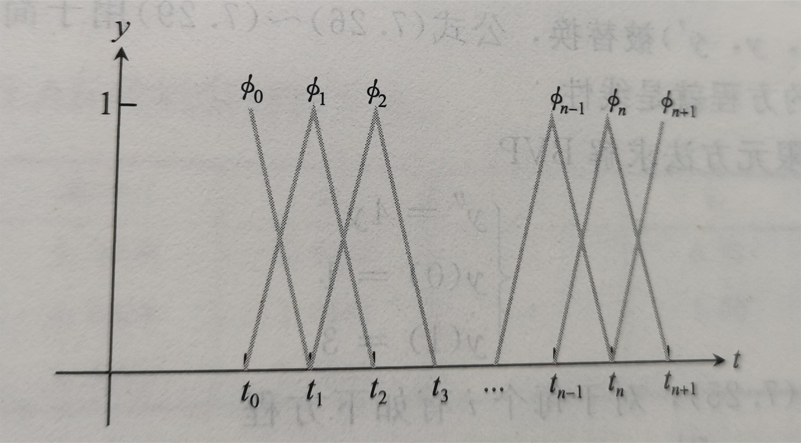

# 数值分析学习笔记（下）

## Chap7 边值问题

边值问题：BVP. 方法有三种类型

1. 打靶方法
2. 有限差分方法
3. 排列方法和有限元方法


### 重点1 打靶方法

一般的二阶边值问题
$$
\left\{ \begin{array}{c}
	y^{''}=f\left( t,y,y^{\prime} \right)\\
	y\left( a \right) =y_a\\
	y\left( b \right) =y_b\\
\end{array} \right.
$$
​	**边值问题**的存在性和唯一性理论比**初值问题**的对应理论**复杂**，看起来合理的BVP可能没有解或有无穷多解，这种情况对于IVP很少见。举例：马戏团的真人大炮。同一个边值问题（明确了，起点和重点位置），存在小于45°和大于45°两种可能情况。但初值问题（给定初始速度）解就是唯一的。


#### 打靶方法的实现

通过找到相同解的IVP，用打靶方法求解BVP。在这个过程中生成一系列IVP，收敛到正确解。

定义
$$
F\left( s \right) =\left\{ \begin{array}{c}
	y_b\text{是}y\left( b \right) \text{之间的差异，其中}y\left( t \right)\\
	\text{是}IVP\text{的解，初值条件为}\\
	y\left( a \right) =y_a,y^{\prime}\left( a \right) =s\\
\end{array} \right.
$$
于是，边值问题，被消减为求解方程
$$
F(s)=0
$$


### 重点2 有限差分方法

> 背后的思想是使用离散近似，替换微分方程中的导数，并且估计格点上的值，得到方程组。

#### 线性边值问题

回顾一阶导数离散近似（三点中心差分公式），系数是用推广中值定理确定的：
$$
y^{\prime}\left( t \right) =\frac{y\left( t+h \right) -y\left( t-h \right)}{2h}-\frac{h^2}{6}y^{\left( 3 \right)}\left( c \right)
$$
二阶导数：
$$
y^{''}\left( t \right) =\frac{y\left( t+h \right) -2y\left( t \right) +y\left( t-h \right)}{h^2}+\frac{h^2}{12}f^{\left( 4 \right)}\left( c \right)
$$
二者误差都和$h^2$成正比。


**例题** 使用有限差分求解BVP（y是关于t的函数）:
$$
\left\{ \begin{array}{c}
	y^{''}=4y\\
	y\left( 0 \right) =1\\
	y\left( 1 \right) =3\\
\end{array} \right.
$$
用二阶导数代替微分方程，在$t_i$处的有限差分格式如下：
$$
\frac{w_{i+1}-2w_i+w_{i-1}}{h^2}-4w_i=0
$$
化简整理得到：
$$
w_{i-1}+\left( -4h^2-2 \right) w_i+w_{i+1}=0
$$


当$n=3，区间长度h=1/(n+1)=1/4$，带入已知的边值条件$w_0=1,w_4=3$，即求解下来方程组：
$$
1+\left( -4h^2-2 \right) w_1+w_2=0
\\
w_1+\left( -4h^2-2 \right) w_2+w_3=0
\\
w_2+\left( -4h^2-2 \right) w_3+3=0
$$


方法的误差阶数是$O(h^2)$. 为了得到更小的误差，可以使用更大的$n$.

加上更多的子区间，期望近似值和真实值更加接近。

有限差分方法潜在的误差来源是中心差分公式的截断误差，和求解方程组带来的误差。


#### 非线性边值问题

**例题** 使用有限差分方法求解BVP
$$
\left\{ \begin{array}{c}
	y^{''}=y-y^2\\
	y\left( 0 \right) =1\\
	y\left( 1 \right) =4\\
\end{array} \right.
$$
和上一题的思路类似，写出离散形式，整理得：
$$
w_{i-1}-\left( 2+h^2 \right) w_i+h^2{w_i}^2+w_{i+1}=0
$$
问题在于无法写成两个矩阵相乘，因为是$w_i$非线性的。

求解边值问题的离散问题意味求解$F(w)=0$. F函数可以使用牛顿方法进行求解：

对应迭代公式$w_{k+1}=w^k-DF(w^k)^{-1}F(w^k)$.

一般地，完成迭代的最好方式是求解方程$DF(w^k)\Delta w=-F(w^k),\ \Delta w=w_{k+1}-w_{k}$.

函数$F(w)$如下：
$$
F\left[ \begin{array}{c}
	w_1\\
	w_2\\
	\vdots\\
	w_{n-1}\\
	w_n\\
\end{array} \right] =\left[ \begin{array}{c}
	y_a-\left( 2+h^2 \right) w_1+h^2{w_1}^2+w_2\\
	w_1-\left( 2+h^2 \right) w_2+h^2{w_2}^2+w_3\\
	\vdots\\
	w_{n-2}-\left( 2+h^2 \right) w_{n-1}+h^2{w_{n-1}}^2+w_n\\
	w_{n-1}-\left( 2+h^2 \right) w_n+h^2{w_n}^2+y_b\\
\end{array} \right]
$$
$y_a=1，y_b=4$,由初值条件给定。

根据函数$F(w)$具体形式，可以确$F$的雅可比矩阵$DF(w)$.


### 重点3 排列与有限元方法

> 和有限差分方法类似，排列和有限元方法背后的思想是将边值问题消减为一组可求解的代数方程。但是并不是通过使用有限差分替代微分方程中的导数进行离散化，而是对解给出的函数形式，其对应的参数使用该方法拟合。

​	选择一组基函数$\phi_1(t),\cdots, \phi_n(t)$,考虑可能的解：
$$
y(t)=c_1\phi_1(t)+\cdots+c_n\phi_n(t)
$$
​	找出近似解的问题被简化为确定$c_i$的值，本节考虑两种方法找出这个系数

* **排列方法**

  将$y(t)=c_1\phi_1(t)+\cdots+c_n\phi_n(t)$带入边值问题，并估计在格点上的值。这种直接方法，将问题消减为求解关于$c_i$的方程组，如果原问题是线性的，方程组也是线性的。每个点给出一个方程，求解方程即可。

* **有限元方式** 

  将拟合视为最小二乘问题而不是插值问题。使用Galerkin投影最小化和精确解在平方误差意义上的差异。

#### 排列方法

按照定义，一步一步可以容易推出。

最简单的基函数，显然是**多项式函数**，但存在龙格现象，不过可以通过切比雪夫的根作为插值点可以改善问题。

选择三角函数作为基带来傅里叶分析以及**谱方法**.


#### 有限元方法

​	选择样条函数作为基函数带来**有限元方法**。在这种方法，每个基函数仅在t的一个小区间非0. 有限元方法大量用于高维情况下的BVP和PDE，特别是存在不规则的边界条件情况，其中使用标准的基函数做参数化变得困难。	

​	在排列方法中，我们假设函数形式$y(t)=\sum c_i \phi_i^{(t)}$，并求解系数$c_i$，其中强制解满足边值条件。并在离散点完全满足微分方程。而Galerkin方法最小化微分方程在解上的平方误差，这带来一个关于$c_i$的不同方程组。

​	选择有限元方法近似BVP
$$
\left\{ \begin{array}{c}
	y^{''}=f\left( t,y,y^{\prime} \right)\\
	y\left( a \right) =y_a\\
	y\left( b \right) =y_b\\
\end{array} \right.
$$
​	**余项**$r=y^{''}-f$，需要使得微分方程两侧差异尽可能小。和第四章的最小二乘法类似，可以选择y使得余项和潜在向量空间正交得到。

​	对于区间$[a,b]$，定义平方可积函数对应的向量空间：
$$
L^2\left[ a,b \right] =\left\{ \text{区间}\left[ a,b \right] \text{上的函数} \left. y\left( t \right) \right|\int_a^b{y\left( t \right) ^2dt\text{存在且有穷}} \right\}
$$
$L^2$函数空间具有**内积**：
$$
\left< y_1,y_2 \right> =\int_a^b{y_1\left( t \right) y_2\left( t \right) dt}
$$


Galerkin方法的一个**核心思想**是**最小化余项**r，其中强制其在$L^2$内积意义上与基函数正交，即：
$$
\int_a^b{\left( y^{''}-f \right) \phi _i\left( t \right) dt}
$$
整理得到边值问题的**弱形式**：
$$
\int_a^b{y^{''}\phi _i\left( t \right) dt}=\int_a^b{f\left( t,y,y^{\prime} \right) \phi _i\left( t \right) dt}
$$
另一个**核心思想**是**部分使用积分消去二阶导数**：
$$
\int_a^b{y^{''}\phi _i\left( t \right) dt}=\phi _i\left( t \right) y^{\prime}\left( t \right) \mid_{a}^{b}-\int_a^b{y^{\prime}\left( t \right)}{\phi _i}^{\prime}\left( t \right) dt
\\
=\phi _i\left( b \right) y^{\prime}\left( b \right) -\phi _i\left( a \right) y^{\prime}\left( a \right) -\int_a^b{y^{\prime}\left( t \right)}{\phi _i}^{\prime}\left( t \right) dt
$$
将上式带入弱形式表达式：
$$
\int_a^b{f\left( t,y,y^{\prime} \right) \phi _i\left( t \right) dt}=\phi _i\left( b \right) y^{\prime}\left( b \right) -\phi _i\left( a \right) y^{\prime}\left( a \right) -\int_a^b{y^{\prime}\left( t \right)}{\phi _i}^{\prime}\left( t \right) dt
$$
以如下函数形式求解$c_i$:
$$
y\left( t \right) =\sum_{i=0}^{n+1}{c_i\phi _i\left( t \right)}
$$


这两个思想使得可以使用非常简单的函数作为有限元$\phi_i(t)$，本书仅介绍分段线性B样条函数。

从t轴上的数据格点$t_0<t_1<\cdots<t_n<t_{n+1}$，对于$i=1,\cdots,n$定义
$$
\phi _i\left( t \right) =\left\{ \begin{array}{c}
	\frac{t-t_{i-1}}{t_i-t_{i-1}}, t_{i-1}<t\le t_i\\
	\frac{t_{i+1}-t}{t_{i+1}-t_i}, t_i<t<t_{i+1}\\
	0, else\\
\end{array} \right.
$$
同时定义
$$
\phi _0\left( t \right) =\left\{ \begin{array}{c}
	\frac{t_1-t}{t_1-t_0}, t_0\le t<t_1\\
	0, else\\
\end{array} \right.
\\
\phi _{n+1}\left( t \right) =\left\{ \begin{array}{c}
	\frac{t-t_n}{t_{n+1}-t_n}, t_n<t\le t_{n+1}\\
	0, else\\
\end{array} \right. 
$$
分段线性B样条函数如图所示：



观察发现函数满足以下**有趣的性质**：
$$
\phi _i\left( t_j \right) =\left\{ \begin{array}{c}
	1, i=j\\
	0, i\ne j\\
\end{array} \right.
$$
对于一组数据点$(t_i, c_i)$,定义**分段线性B样条**
$$
S(t)=\sum_{i=0}^{n+1}{c_i \phi_i(t)}
$$
由函数性质：
$$
S(t)=\sum_{i=0}^{n+1}{c_i \phi_i(t)}
$$
带入$t_j$时刻，有$S(t_j)=c_j$.

于是$S(t)$是分段线性方程,并且对数据点$(t_i,c_i)$插值（y坐标就是系数）。


现在讨论，怎么基于这个函数和之前的方程求解$c_i$.

第一个和最后一个$c_i$通过排列方法得到：
$$
y\left( a \right) =\sum_{i=0}^{n+1}{c_i\phi _i\left( a \right) =c_0\phi _0\left( a \right) =c_0}
\\
y\left( b \right) =\sum_{i=0}^{n+1}{c_i\phi _i\left( a \right) =c_{n+1}\phi _{n+1}\left( b \right) =c_{n+1}}
$$
对于$i=1,2...,n$使用有限元方程
$$
\int_a^b{f\left( t,y,y^{\prime} \right) \phi _i\left( t \right) dt}=\phi _i\left( b \right) y^{\prime}\left( b \right) -\phi _i\left( a \right) y^{\prime}\left( a \right) -\int_a^b{y^{\prime}\left( t \right)}{\phi _i}^{\prime}\left( t \right) dt
$$
而$\phi _i\left( b \right) y^{\prime}\left( b \right) -\phi _i\left( a \right) y^{\prime}\left( a \right)=0$($i\ne a\ or\ b$，边界项为0)

再代入$y(t)=\sum c_i \phi_i(t)$得到：
$$
\int_a^b{f\left( t,\sum{c_j}\phi _j\left( t \right) ,\sum{c_j}{\phi _j}^{\prime}\left( t \right) \right) \phi _i\left( t \right) dt}+\int_a^b{{\phi _i}^{\prime}\left( t \right) \sum{c_j}{\phi _j}^{\prime}\left( t \right)}dt=0
$$
假设格点是均匀分布的，我们需要下面的积分（带入定义，一次函数非常好积）：
$$
\int_a^b{\phi _i\left( t \right)}\phi _{i+1}\left( t \right) dt=\frac{h}{6}
\\
\int_a^b{\phi _i\left( t \right)}\phi _i\left( t \right) dt=\frac{2h}{3}
\\
\int_a^b{{\phi ^{\prime}}_i\left( t \right)}{\phi ^{\prime}}_{i+1}\left( t \right) dt=-\frac{1}{h}
\\
\int_a^b{{\phi ^{\prime}}_i\left( t \right)}{\phi ^{\prime}}_i\left( t \right) dt=\frac{2}{h}
$$
**结论**：和有限差分几乎一样，都是$O(n^{-2})$的收敛（$O(n^{-2})=O(h^2)$）


## Chap8 偏微分方程

本节只讨论有两个独立变量的PDE方程
$$
Au_{xx}+Bu_{xy}+Cu_{yy}+F\left( u_x,u_y,u,x,y \right) =0
$$
分类如下：
$$
\left( 1 \right) \,\,B^2-4AC=0\text{，抛物线}
\\
\left( 2 \right) \,\,B^2-4AC>0\text{，双曲线}
\\
\left( 3 \right) \,\,B^2-4AC<0\text{，椭圆}
$$


### 重点1 抛物线方程

#### 前向差分方法

使用有限差分近似PDE方程的解。思路是在独立变量空间中放置网格，并对PDE离散化。连续问题变成有限方程构成的离散问题。如果PDE是线性的，则离散方程也是线性的。

令$M,N$为x和t方向的所有步数，令$h=(b-a)/M, k=T/N$是x与t方向的步长。

使用中心差分公式，关于x的二阶导数如下：
$$
u_{xx}\left( x,t \right) \approx \frac{1}{h^2}\left( u\left( x+h,t \right) -2u\left( x,t \right) +u\left( x-h,t \right) \right)
$$
回顾证明思路：

分别把$f(x+h),f(x-h)$泰勒展开，做差表示二阶导，再利用推广中值定理。

误差为$h^2u_{xxxx}\left( c_1,t \right) /12$


对于时间变量，用一阶导数前向差分公式：
$$
u_t\left( x,t \right) \approx \frac{1}{k}\left( u\left( x,t+k \right) -u\left( x,t \right) \right)
$$
误差为$k u_{tt}(x,c_2)/2,x-h<c_1<x+h,t<c_2<t+h$.

把差分结果带入方程有：
$$
\frac{D}{h^2}\left( w_{i+1,j}-2w_{ij}+w_{i-1,j} \right) \approx \frac{1}{k}\left( w_{i,j+1}-w_{ij} \right)
$$
局部截断误差为$O(k+h^2)$.

整理上式得到：
$$
w_{i,j+1}=w_{ij}+\frac{DK}{h^2}\left( w_{i+1,j}-2w_{ij}+w_{i-1,j} \right) =\sigma w_{i+1,j}+\left( 1-2\sigma \right) w_{ij}+\sigma w_{i-1,j}, \sigma =\frac{DK}{h^2}
$$
显然这是显示方法，由前面已知的值确定新值（关于t的）


给出一个矩阵：
$$
T=\left[ \begin{matrix}
	\begin{matrix}
	1&		-1&		0\\
\end{matrix}&		\cdots&		0\\
	\begin{matrix}
	-1&		1&		-1\\
\end{matrix}&		\ddots&		\vdots\\
	\begin{matrix}
	\begin{array}{c}
	0\\
	\vdots\\
	0\\
\end{array}&		\begin{array}{c}
	-1\\
	\ddots\\
	\cdots\\
\end{array}&		\begin{array}{c}
	1\\
	\ddots\\
	0\\
\end{array}\\
\end{matrix}&		\begin{array}{c}
	\ddots\\
	\ddots\\
	-1\\
\end{array}&		\begin{array}{c}
	\begin{array}{c}
	0\\
	-1\\
\end{array}\\
	1\\
\end{array}\\
\end{matrix} \right]
$$
矩阵$T$的特征向量是：
$$
v_j=\left[ \sin \frac{j\pi}{m+1}, \sin \frac{2j\pi}{m+1},\cdots , \sin \frac{mj\pi}{m+1} \right]
$$
特征值是$\lambda_i=1-2cos\pi j/(m+1).$

知道这个矩阵的特征值和特征矩阵就可以求出任何三对角矩阵的特征值（记三对角矩阵为$A$, $A=\alpha I+\beta T, \alpha,\beta为常数$）

之前迭代方法的时候介绍过一个定理：

==如果$n\times n$矩阵$A$具有谱半径$\rho(A)<1$,$b$为任意向量，则对于任意向量$x_0$,迭代过程$x_{k+1}=Ax_k+b$收敛。==

迭代矩阵$A=-\sigma T+(1-\sigma)I$.

那么特征值$\lambda=-\sigma(1-2cos\pi j/(m+1))+1-\sigma=2\sigma (cos\pi j/(m+1)-1)+1$.

则特征值的范围是$[-4\sigma+1, 1]$.

解得$0<\sigma<\frac{1}{2}$.(隐含D大于0)


对于热方程$u_t=Du_{xx}$应用前向差分方法，令h为空间步长，k为时间步长，其中D>0. 如$\frac{Dk}{h^2}<\frac{1}{2}$, 前向方法稳定


#### 后向差分方法

还是使用中心差分公式替换热方程的$u_{xx}$, 但使用后向差分近似：
$$
u_t=\frac{1}{k}\left( u\left( x,t \right) -u\left( x,t-k \right) +\frac{k}{2}u_{tt}\left( x,c_0 \right) \right)
$$
其中$t-k<c_0<t$

那么截断误差显然还是$O(k+h^2)$.

重写方法得到：
$$
-\sigma w_{i+1,j}+\left( 1+2\sigma \right) w_{ij}-\sigma w_{i-1,j}=w_{i,j-1}
$$
其中$\sigma=Dk/h^2$.

把后向差分看成：$w_j=A^{-1}w_{j-1}+b$.

结论：后向差分方法，令h为空间步长，k为时间步长，其中D>0. 后向方法无条件稳定（A逆的谱半径恒小于1）

同理前向方法， 用到逆矩阵的特征值是原矩阵的特征值倒数。


#### Crank-Nicolson方法

结合显式和隐式方法，是无条件稳定的，且在时间和空间有二阶精度。

使用后向差分公式替换$u_t$：
$$
\frac{1}{k}(w_{ij}-w_{i,j-1})
$$
使用混合差分替换$u_{xx}$:
$$
\frac{1}{2}(\frac{w_{i+1,j}-2w_{ij}+w_{i-1,j}}{h^2})+\frac{1}{2}\left( \frac{w_{i+1,j-1}-2w_{i,j-1}+w_{i-1,j-1}}{h^2} \right)
$$
截断误差是$O(h^2+k^2)$, 优于前向差分和后向差分。


### 重点2 双曲线方程

考虑PDE方程
$$
u_{tt}=c^2 u_{xx}
$$
$B^2-4AC=0--4c^2=4c^2>0$，波动方程为双曲线方程

使用有限差分方法，误差是$O(h^2+k^2)$.

#### CFL条件

如果$\sigma=ck/h\le 1$, 则应用于波动方程的有限差分方法稳定，其中波速$c>0$.

$ck/h$被称为方法的CFL数，一般地，CFL数最多为1以保证求解器稳定。


### 重点3 椭圆方程

#### 有限差分方法

扩散方程对热流建模，是时间的函数。

波动方程分析波的运动，也是时间的函数。

椭圆方程，是本节讨论的重点，它对稳定状态建模，例如热在一个平面区域的稳态分布。


定义：
$$
\Delta u=u_{xx}+u_{yy}
$$
泊松方程
$$
\Delta u(x,y)=f(x,y)
$$
若函数项为0，称为拉普拉斯方程。拉普拉斯方程的解称为调和函数。


使用中心差分公式进行拉普拉斯算子的近似：
$$
\frac{w_{i+1,j}-2w_{ij}+w_{i-1,j}}{h^2}+\frac{w_{i,j-1}-2w_{i,j}+w_{i-1,j+1}}{k^2}=f\left( x_i,y_i \right)
$$
==想和之前一样写成矩阵形式的方程进行迭代，但需要对双索引进行重新标记，形成线性顺序。？？？==

处理不了$w_{i-1,j+1}$这一项，如果按照分离j和j-1，j+1就无法处理。同理分离i


方程误差关于$h,k$都是二阶的


#### 有限元方法

考虑椭圆方程的狄利克雷边界问题：
$$
\Delta u+r\left( x,y \right) u=f\left( x,y \right) , \text{在区域}R
\\
u=g\left( x,y \right) , \text{在区域}S
$$
和第七章一样，使用区域R上$L^2$空间：
$$
L^2\left( R \right) =\left\{ R\text{上的函数}\left. \phi \left( x,y \right) \right|\iint_R{\phi ^2\left( x,y \right) dxdy}\text{存在且有界} \right\}
$$
使用$L^2_0(R)$代表$L^2(R)$的子空间，包含区域R边界S上值为0的函数。

目标是最小化椭圆方程的平方误差，其中强制余项$\Delta(x,y)+r(x,y)u(x,y)-f(x,y)$和子空间$L^2(R)$正交。

令$\phi_1(x,y),\cdots, \phi_P(x,y)$是$L^2(R)$的元素，正交假设为以下形式：
$$
\iint_R{\left( \Delta u+ru-f \right) \phi _pdxdy}=0
$$


格林第一等式：令R使用分段光滑的曲线S定义。令$u,v$为平滑函数，令$n$为边界上的向外单位法线。则：
$$
\iint_R{v\Delta u}=\int_S{v\frac{\partial u}{\partial n}dS-\iint_R{\nabla u\cdot \nabla v}}
$$
证明：

由散度定理：
$$
\int_{\Omega}{divP\left( x_1,x_2,\cdots ,x_n \right) dx}=\int_{\Gamma}{\sum_{i=1}^n{P_i}\cos \left( \nu ,x_i \right) dS}
$$
取$P_i=u\frac{\partial v}{\partial x_i}$带入散度定理：
$$
\int_{\Omega}{u\Delta _nvdx}+\int_{\Omega}{\sum_{i=1}^n{v_{x_i}u_{x_i}dx}=\int_{\Gamma}{v\frac{\partial u}{\partial \nu}dS\left( x \right)}}
$$
将$u,v$交换即可。

有限元方法的本质是将
$$
w(x,y)=\sum_{q=1}^{p}{v_q \phi_q(x,y)}
$$
替代偏微分方程弱形式u，然后确定未知常数$v_q$.

把Green公式运用到正交假设，再带入对真实值的逼近函数：
$$
\sum_{q=1}^P{v_q\left[ \iint_R{\nabla \phi _q\cdot \nabla \phi _pdxdy}-\iint_R{r\phi _q\phi _pdxdy} \right]}=-\int_R{f\phi _pdxdy}
$$
用矩阵形式计算，方程为Av=b, 取
$$
A_{pq}=\iint_R{\nabla \phi _q\cdot \nabla \phi _pdxdy}-\iint_R{r\phi _q\phi _pdxdy}
\\
b_p=-\int_R{f\phi _pdxdy}
$$
从$L^2(R)$选择有限元函数$\phi_p$,得到$P=mn$个分段线性函数，每个函数在左图的一个格点值为1，其他格点值为0.

从而（好处是求解$Av=b$就可以立刻知道近似的$w$)
$$
w\left( x_i,y_j \right) =\sum_{i=1}^m{\sum_{j=1}^n{v_{i+\left( j-1 \right) m}\phi _{i+\left( j-1 \right) m}\left( x_i,y_i \right)}}=v_{i+\left( j-1 \right) m}
$$


对于这个积分的处理：
$$
A_{pq}=\iint_R{\nabla \phi _q\cdot \nabla \phi _pdxdy}-\iint_R{r\phi _q\phi _pdxdy}
\\
b_p=-\int_R{f\phi _pdxdy}
$$
给出一个引理：在平面区域R上的**线性函数**$L(x,y)$的平均值$L(\overline{x},\overline{y})$(即在重心处的值)，也就是:
$$
\iint_R{L\left( x,y \right) dxdy}=L\left( \overline{x},\overline{y} \right) \cdot area\left( R \right)
$$
从而得到二维中点法则
$$
\iint_R{f\left( x,y \right) dxdy}=f\left( \overline{x},\overline{y} \right) \cdot area\left( R \right) +O\left( h^4 \right)
$$
其中$h为R的对角线(h=diam(R))$

然后再拓展一下就可以求出每一项的积分，就能解方程求出估计值了。。


#### 重点4 非线性偏微分方程

$$
u_t+uu_x=Du_{xx}
$$

称为Burgers方程。该方程是液体流动的简化模型。当扩散系数$D=0$，被称为逆Burgers方程。设置$D>0$则对模型增加黏度。

参考之前的操作，$u_t$采取后向差分，$u_x,u_{xx}$采取中心差分，得到：
$$
w_{ij}+\frac{k}{2h}w_{ij}\left( w_{i+1,j}-w_{i-1,j} \right) -\sigma \left( w_{i+1,j}-2w_{ij}+w_{i-1,j} \right) -w_{i,j-1}=0
$$
其中$\sigma=Dk/h^2$.

由于出现$w$的二次项，所以不能直接隐式或显示求解。

记$z_i=w_{ij}$, 于是问题转化为在时间步j, 对于m个未知变量用牛顿迭代法：
$$
F_i\left( z_1,\cdots ,z_m \right) =z_i+\frac{k}{2h}z_i\left( z_{i+1}-z_{i-1} \right) -\sigma \left( z_{i+1}-2z_i+z_{i-1} \right) -w_{i,j-1}=0
$$
注意到$w_{i,j-1}$可以从上次求解得到。

考虑狄利克雷边界条件的Burgers方程：
$$
\left\{ \begin{array}{c}
	u_t+uu_x=Du_{xx}\\
	u\left( x,0 \right) =f\left( x \right) , x_l\le x\le x_r\\
	u\left( x_l,t \right) =l\left( t \right) , \forall t\ge 0\\
	u\left( x_r,t \right) =r\left( t \right) , \forall t\ge 0\\
\end{array} \right.
$$
边界上进行适当替换：
$$
F_1\left( z_1,\cdots ,z_m \right) =z_1-l\left( t_j \right) =0
\\
F_m\left( z_1,\cdots ,z_m \right) =z_m-r\left( t_j \right) =0
$$
回忆**多变量牛顿迭代法公式**：
$$
\vec{z}^{k+1}=\vec{z}^k-DF\left( \vec{z}^k \right) ^{-1}F\left( \vec{z}^k \right)
$$
其中雅可比矩阵$DF$在知道F函数后就是容易计算的。


定义：d阶**同质多项式**
$$
\forall c, P(cx_1,\cdots,cx_m)=c^dP(x_1,\cdots,x_m)
$$
令$P(x_1,\cdots,x_m)$为d阶同质多项式，则，==这里d是d阶的意思，不是微分算子==
$$
\nabla P\cdot \left[ \begin{array}{c}
	x_1\\
	\vdots\\
	x_n\\
\end{array} \right] =dP
$$


## Chap9 随机数和应用

### 重点1 随机数

直观上，随机数是显然的。但是数学上给出精确的定义却是异常困难的。

计算机只能按照程序员预先设计的程序执行，所以不可能产生真正的随机数。

随机数生成器的目的是将输出数据满足独立同分布。


#### 伪随机数

定义 线性同余生成器（LCG）表现为以下形式：
$$
x_i=ax_{i-1}+b\left( mod\,\,m \right)\\
u_i=\frac{x_i}{m}
$$


其中$a为乘子，b为偏移，m为模数$.


应用举例：近似曲线$y=x^2$在[0, 1]区间上曲线下面的面积。

由定义可知，$\int_0^1{x^2}$为所求面积，恰好为函数y的均值。

通过在定义上随机选点，计算函数输出的均值来确定（使用10个随机数）：
$$
\frac{1}{10}\sum_{i=1}^{10}{f\left( u_i \right)}
$$
这个应用称为蒙特卡罗1型问题，用来解决函数均值问题。

如果问题需要更高精度，则需要我们增大$a和m$.


Parker和Miller提出了一种线性同余生成器，称为“最小标准”生成器。1990年的MATLAB第四版就使用了这样的随机数生成器：
$$
x_i=ax_{i-1}\left( mod\,\,m \right) 
\\
u_i=\frac{x_i}{m}
\\
m=2^{31}-1, a=7^5, b=0
$$
形如$2^p-1$的素数(p为整数)，称为梅森素数。

欧拉发现了梅森素数，最小标准随机数生成器的重复周期就达到理论最大值$2^{31}-2$.

这包含了大约$2\times 10^9$个数，不过对于现代计算机还是太少了。


例 计算满足以下不等式点的面积
$$
4\left( 2x-1 \right) ^4+8\left( 2y-1 \right) ^8<1+2\left( 2y-1 \right) ^3\left( 3x-2 \right) ^2
$$
我们称之为蒙特卡洛2型问题，这个问题无法转化为计算函数均值的问题。但给定(x,y)就可以容易判断是否在点内。

实际上这两类问题没有显著区别，都是计算了某个函数的均值。

1型问题是显然的。

2型问题，看成计算集合的特征函数，如果点在集合内就记为1(True)，反之记为0(False).

然后求特征函数均值，代表这个平均面积。


**randu生成器**
$$
x_i=ax_{i-1}\left( mod\,\,m \right) 
\\
u_i=\frac{x_i}{m}
\\
a=65539=2^{16+3}, m=2^{31}.
$$
随机种子$x_0\ne 0$可以任意选取。非素模数m选取是为为了加快取模的速度。a的选取是因为它的二进制表示很简单。

但这个算法的问题在于它不满足随机数之间的独立性：

注意到
$$
a^2-6a=(2^{16}+3)^2-6(2^{16}+3)=2^{32}-9
$$
于是$a^2-6a+9=0(mod\ m)$

第一个等式是带入$x_i=ax_{i-1}$的定义：
$$
x_{i+2}-6x_{i+1}+9x_i=a^2x_i-6ax_i+9x_i\left( mod\,\,m \right) =0\left( mod\,\,m \right)
$$
同除m得到, mod 1相当于等式关系：
$$
u_{i+2}=6u_{i+1}-9u_i(mod\ 1)
$$
由于生成器本身是确定的公式，因此只要知道上一个数字就可以预测当前的数。

最大问题在于$u_{i+2}=6u_{i+1}-9u_i(mod\ 1)$递推**关系式的系数还是太小了，使得随机关系很容易被察觉。**


最小标准生成器的问题至少没有randu生成器这么明显。

最新版的matlab使用延迟斐波那契数生成器，**生成0到1的浮点数**，重复周期大于$2^{1400}$。

[a, b]区间上的随机数可以对[0, 1]进行线性变换得到。


#### 指数和正态随机数

指数随机变量的取值满足概率分布函数$p(x)=ae^{-ax},a>0$.

使用上一节的均匀分布函数，容易生成指数随机数，累计分布函数为：
$$
P(x)=Prob(V\le x)=\int_0^x{p(x)dx}=1-e^{-ax}
$$
算法的核心思想是找到指数随机变量的值，使得**概率$Prob(V\le x)$是区间[0,1]的均匀分布**：
$$
u=Prob(V\le x)=1-e^{-ax}
$$
通过求解x得到：
$$
x=\frac{-ln(1-u)}{a}
$$
使用这个公式就可以将输入的均匀随机数转化为指数随机数。

对于一般的概率分布也可以使用类似的思路。

假设$P(x)$是需要生成随机变量对应的概率分布函数。$Q(x)=P^{-1}(x)$是对应的反函数。

若$U[0,1]$是[0,1]区间上均匀分布的随机数,则$Q(U[0,1])$就是满足P分布的随机数。


对于标准正态分布，获得其随机数生成，则可获取任意正态分布随机数
$$
P(x)=\frac{1}{\sqrt{2\pi}}e^{-\frac{x^2}{2}}
$$
用另一种方法求解，可以同时生成两个正态分布随机数。

二维标准正态分布概率密度函数为$p(x,y)=(1/2\pi)e^{-(x^2+y^2)/2}$.

写成极坐标$p(r)=(1/2\pi)e^{-r^2/2}$形式

由于$p(r)$是对极坐标对称的，我们只需要考虑半径r，角度可以用$[0,2\pi]$的均匀分布。

这样，$p(r)$是关于变量$r^2$的指数分布，参数$a=1/2$.
$$
r^2=\frac{-ln(1-u_1)}{1/2}
$$
其中$u_1$是均匀分布随机数，进而生成两个满足标准正态分布且完全独立的随机数：
$$
n_1=r\cos 2\pi u_2=\sqrt{-2\ln \left( 1-u_1 \right)}\cos 2\pi u_2
\\
n_2=r\sin 2\pi u_2=\sqrt{-2\ln \left( 1-u_1 \right)}\sin 2\pi u_2
$$
其中$1-u_1$可以用$u_1$代替，因为都是[0,1]区间均匀分布。

这种生成正态分布随机数的方法称为**Box-Muller**方法.


### 重点2 蒙特卡罗模拟

#### 幂律和蒙特卡罗模拟

我们希望了解蒙特卡罗模拟的收敛速度。当点数n增加时，测量误差会以什么样的速度减小？

1型或2型蒙特卡罗模拟具有伪随机数字.
$$
Error\propto n^{-\frac{1}{2}}
$$


**拟随机数**的理念时在条件允许情况下，放弃对随机数独立性的要求。设计是使得生成序列是**自避的**(Self-avoiding)，而不一定要保证独立性。自避的定义是，在生成随机数序列过程中，新的数会填充到比较稀疏的区域，而不会聚到一起。

一种最流行的方法生成拟随机数是Van der Corput在1935年提出的**p进制下的低差异序列算法**：

设p为素数，例如p=2. 按p进制表示写出1~n的自然数. 假设第i个数字的p进制表示为$b_k b_{k-1}\cdots b_2 b_1$.

则我们要生成的随机数就是$0.b_1 b_{2}\cdots b_{k-1} b_k$.

换句话说，整个生成过程就是先写出第i个整数，然后把位数反过来写，再放到小数点的另一侧，最后输出[0, 1]区间上均匀分布的第i个随机数。

算例：p=2, i=4.

1. 先把4写成二进制$4_{(10)}=100_{(2)}$.
2. 生成的随机数是$0.001_{(2)}$
3. 转回十进制：$0.001_{(2)}=0.125_{(10)}$

1型蒙特卡罗问题（拟随机数）
$$
Error\propto \left( \ln n \right) ^dn^{-1}
$$
2型蒙特卡罗问题（拟随机数）
$$
Error\propto n^{-\frac{1}{2}-\frac{1}{2d}}
$$


### 重点3 随机微分方程

ODE只能分析确定模型。对于很多系统来说，我们无法建立面面俱到的确定模型，系统的一些部分很好建模，但另外一些部分可能更具随机性——变化独立于系统的当前状态。在这种情况下，常用的方法是在微分方程中加入一个噪声项来表示随机影响。这样得到一个随机微分方程(SDE: stochastic differential equation).

#### 有噪声的微分方程

**定义** 以实数$t\ge 0$为索引的随机变量集合$x_t$称为时域连续随机过程。

考虑以下SDE初值问题：
$$
\left\{ \begin{array}{c}
	dy=rdt+\sigma dB_t\\
	y\left( 0 \right) =0\\
\end{array} \right.
$$
包括布朗运动在内的很多随机过程是连续但不可微的，所以常常把微分形式写成积分形式:
$$
y\left( t \right) =y\left( 0 \right) +\int_0^t{f\left( s,y \right) ds}+\int_0^t{g\left( s,y \right) dB_s}
$$
公式的第二个积分项称为**Ito积分**.

定义如下：
$$
\int_a^b{f\left( t \right) dB_t}=\underset{\Delta t\rightarrow 0}{\lim}\sum_{i=1}^n{f\left( t_{i-1} \right) \Delta B_i}
$$
其中$Delat=B_{t_i}-B_{t_{i-1}}$. 并且Ito积分中$t_i^{'}$要取区间的左端点。

因为$f,B_t$是随机函数，所以Ito积分为$I=\int_a^b{f(t)dB_t}$.

布朗运动$B_t$的微分$dB_t$为白噪声。

Ito公式：若$y=f(t,x)$，则
$$
dy=\frac{\partial f}{\partial t}\left( t,x \right) dt+\frac{\partial f}{\partial x}\left( t,x \right) dx+\frac{1}{2}\frac{\partial ^2f}{\partial x^2}\left( t,x \right) dxdx
$$


#### 数值求解SDE

给出给定SDE初值问题
$$
\left\{ \begin{array}{c}
	dy\left( t \right) =f\left( t,y \right) dt+g\left( t,y \right) dB_t\\
	y\left( a \right) =y_a\\
\end{array} \right.
$$
**Euler-Maruyama方法**：

$w_0=y_0$

for i = 0, 1, 2, ...

​	$w_{i+1}=w_i+f(t_i,w_i)(\Delta t_i)+g(t_i,w_i)(\Delta B_i)$

end

其中$\Delta t_i=t_{i+1}-t_i,\ \Delta B_i=\Delta B_{t_{i+1}}-B_{t_i}$.


## Chap10 三角插值和FFT

### 重点1 Fourier变换

​	在模为1的复数上，若复数$z:z^n=1$.则称其为n次单位根。如果1个n次单位根对任何$k<n$都不是k次单位根，则称它为本源单位根。设$w$为n次本原单位根，k为整数，则容易得到：
$$
\sum_{j=0}^{n-1}{w^{jk}}=\left\{ \begin{array}{c}
	n, n/k\text{为整数}\\
	0\text{，} else\\
\end{array} \right.
$$

#### 离散傅里叶变换

**定义** $x=[x_0,x_1,...,x_{n-1}]^T$的离散傅里叶变换(DFT)为n维向量$y=[y_0,\cdots, y_{n-1}]$.其中$w=e^{-i2\pi /n}$.
$$
y_k=\frac{1}{\sqrt{n}}\sum_{j=0}^{n-1}{x_jw^{jk}}
$$
写成矩阵形式


因此逆DFT变换矩阵也就是$F_n$的共轭矩阵：
$$
F_n^{-1}=\overline{F}_n
$$


**定义** 复向量v的模为实数$\left\| v \right\| =\sqrt{\overline{v}^Tv}$. 若方阵满足$\overline{F}^TF=I$, 则称**F**为酉矩阵。

可以把酉矩阵看作实数域上正交阵的复数扩展。按定义验证$F和F^{-1}$不改变向量的模($\left\| Fv \right\| ^2=v^2,\left\| F^{-1}v \right\| ^2=v^2$)


应用DFT实际上就是与$n\times n$矩阵$F_n$相乘，复杂度为$O(n^2)$. 逆变换即乘$F^{-1}$,也是$O(n^2)$的复杂度


#### 快速傅里叶变换(FFT)

在$O(nlogn)$时间内完成DFT运算。

由上一节可知，DFT运算可以写成：
$$
\left[ \begin{array}{c}
	y_0\\
	\vdots\\
	y_{n-1}\\
\end{array} \right] =\frac{1}{\sqrt{n}}M_n\left[ \begin{array}{c}
	x_0\\
	\vdots\\
	x_{n-1}\\
\end{array} \right]
$$
其中
$$
M_n=\left[ \begin{matrix}
	\begin{matrix}
	w^0&		w^0\\
\end{matrix}&		w^0&		w^0&		w^0\\
	\begin{matrix}
	w^0&		w^1\\
\end{matrix}&		w^2&		\cdots&		w^{n-1}\\
	\begin{matrix}
	w^0&		w^2\\
\end{matrix}&		w^4&		\cdots&		w^{2\left( n-1 \right)}\\
	\begin{matrix}
	\begin{array}{c}
	\vdots\\
	w^0\\
\end{array}&		\begin{array}{c}
	\vdots\\
	w^{n-1}\\
\end{array}\\
\end{matrix}&		\begin{array}{c}
	\vdots\\
	w^{2\left( n-1 \right)}\\
\end{array}&		\begin{array}{c}
	\ddots\\
	\cdots\\
\end{array}&		\begin{array}{c}
	\vdots\\
	w^{\left( n-1 \right) ^2}\\
\end{array}\\
\end{matrix} \right]
$$
简略思路，以n=4为例：

把偶数项写在前面：
$$
z_0=w^0x_0+w^0x_2+w^0\left( w^0x_1+w^0x_3 \right) 
\\
z_1=w^0x_0+w^2x_2+w^1\left( w^0x_1+w^2x_3 \right) 
\\
z_2=w^0x_0+w^4x_2+w^2\left( w^0x_1+w^4x_3 \right) 
\\
z_3=w^0x_0+w^6x_2+w^3\left( w^0x_1+w^6x_3 \right)
$$
因为$w^4=1$
$$
z_0=w^0x_0+w^0x_2+w^0\left( w^0x_1+w^0x_3 \right) 
\\
z_1=w^0x_0+w^2x_2+w^1\left( w^0x_1+w^2x_3 \right) 
\\
z_2=w^0x_0+w^4x_2+w^2\left( w^0x_1+w^0x_3 \right) 
\\
z_3=w^0x_0+w^6x_2+w^3\left( w^0x_1+w^2x_3 \right)
$$
观察发现1，3行和2，4行结构相似，我们定义，其中$\mu=w^2$是二次单位根：
$$
u_0=\mu ^0x_0+\mu ^0x_2
\\
u_1=\mu ^0x_0+\mu ^1x_2
\\
v_0=\mu ^0x_1+\mu ^0x_3
\\
v_1=\mu ^0x_1+\mu ^1x_3
$$
写成矩阵形式：
$$
u=M_2\left[ \begin{array}{c}
	x_0\\
	x_2\\
\end{array} \right] , v=M_2\left[ \begin{array}{c}
	x_1\\
	x_3\\
\end{array} \right]
$$
综上，DFT(4)的计算可以写成2个DFT(2)和一些加乘运算。

计算次数由如下定理给出：

设n是2的幂，则大小为n的FFT变换需要$n(2log_2n-1)+1$次加法和乘法运算，以及一次除以$\sqrt{n}$的计算。


DFT的快速算法可以直接用来计算逆DFT运算：
$$
{F_n}^{-1}y=\overline{F_n}y=\overline{F_n\overline{y}}
$$
也就是对y取共轭后进行DFT运算，再取共轭，就能得到逆DFT运算结果.


### 重点2 三角插值

DFT有什么用？本节介绍一种插值方法：输入是均匀分布的样本点，通过DFT变换得到的输出向量y是插值的系数。

#### DFT插值定理

设$[c,d]$为参数区间，n为正整数。定义$\Delta t=(d-c)/n,\ t_j=c+j\Delta t, where\ j=0,1,\cdots,n-1$.

这是在参数区间均匀分布的样本点。

向量x为傅里叶变换的输入，$x_j$可以理解为一个信号第j个分量。

设$y=F_nx$是x的傅里叶变换，由于x是y的逆傅里叶变换，根据傅里叶矩阵的逆矩阵（重点1图片的10.10），得到：
$$
x_j=\frac{1}{\sqrt{n}}\sum_{k=0}^{n-1}{y_k\left( w^{-k} \right) ^j}=\frac{1}{\sqrt{n}}\sum_{k=0}^{n-1}{y_ke^{i2\pi kj/n}}=\sum_{k=0}^{n-1}{y_k\frac{e^{\frac{i2\pi k\left( t_j-c \right)}{d-c}}}{\sqrt{n}}}\left( \text{带入时间变量}j \right)
$$
可以把上述公式看作对采样点$(t_j,x_j)$的插值，其中使用三角函数作为基函数，插值系数为$y_k$.


反过来，也可以把插值系数还原为数据采样点，只需要将插值系数${a_k+ib_k}$乘上$F^{-1}_n$.


### 重点3 FFT和信号处理

令$f_0(t),\cdots,f_{n-1}(t)$为关于时间t的函数,$t_0,\cdots,t_{n-1}$为实数。

设$n\times n$矩阵为
$$
A=\left[ \begin{matrix}
	f_0\left( t_0 \right)&		f_0\left( t_1 \right)&		\cdots&		f_0\left( t_{n-1} \right)\\
	f_1\left( t_0 \right)&		f_1\left( t_1 \right)&		\cdots&		f_1\left( t_{n-1} \right)\\
	\vdots&		\vdots&		\ddots&		\vdots\\
	f_{n-1}\left( t_0 \right)&		f_{n-1}\left( t_1 \right)&		\cdots&		f_{n-1}\left( t_{n-1} \right)\\
\end{matrix} \right]
$$
为实数正交矩阵，对于$y=Ax$, 以下函数
$$
F\left( t \right) =\sum_{k=0}^{n-1}{y_kf_k\left( t \right)}
$$
是通过采样点$(t_{0},x_{0}),\cdots,(t_{n-1},x_{n-1})$的插值函数，即$F(t_j)=x_j,\ j=0,\cdots,n-1.$


**正交函数最小二乘近似定理** 令$m\le n$为整数，已知样本点$(t_{0},x_{0}),\cdots,(t_{n-1},x_{n-1})$. 令$y=Ax$, 其中A为正交矩阵。则在基函数$f_{0}(t),\cdots,f_{n-1}(t)$插值多项式为
$$
F_n\left( t \right) =\sum_{k=0}^{n-1}{y_kf_k\left( t \right)}
$$
且用函数$f_{0},\cdots,f_{m-1}$进行最小二乘拟合的结果是
$$
F_m\left( t \right) =\sum_{k=0}^{m-1}{y_kf_k\left( t \right)}
$$
这个结论非常漂亮，也很实用。说明对给定的n个数据点，用$m<n$个三角函数进行最小二乘拟合后，只需要计算n阶插值，再取前m个项即可。即x的插值系数Ax在丢弃高频分量后，仍然是x的最佳拟合函数。

这个定理和单项式基函数的区别在于：例如同样的数据点，用一次函数和二次函数拟合，系数没有明显的关系。但三角函数基函数就不会出现这个问题。高阶拟合包含了低阶拟合的信息。


## Chap11 压缩

本章介绍**离散余弦变换**方法，它是傅里叶变换的一种变形，且可以通过实数运算完成。在音频和图像压缩中，DCT是一种被经常选用的方法。

### 重点1 离散余弦变换(DCT)

#### 一维DCT

 DCT: Discrete Cosine Transform. 设n为整数，一维的n阶DCT变换定义为$n\times n$矩阵C, 其元素为：
$$
C_{ij}=\frac{\sqrt{2}}{\sqrt{n}}a_i\cos \frac{i\left( 2j+1 \right) \pi}{2n}
$$
where i,j =0, ..., n-1.
$$
a_i=\left\{ \begin{array}{c}
	1/\sqrt{2}, i=0\\
	1, i\ne 0\\
\end{array} \right.
$$
即
$$
C=\sqrt{\frac{2}{n}}\left[ \begin{matrix}
	\begin{array}{c}
	\frac{1}{\sqrt{2}}\\
	\cos \frac{\pi}{2n}\\
\end{array}&		\begin{array}{c}
	\frac{1}{\sqrt{2}}\\
	\cos \frac{3\pi}{2n}\\
\end{array}&		\begin{array}{c}
	\cdots\\
	\\
	\cdots\\
\end{array}&		\begin{array}{c}
	\frac{1}{\sqrt{2}}\\
	\cos \frac{\left( 2n-1 \right) \pi}{2n}\\
\end{array}\\
	\cos \frac{2\pi}{2n}&		\cos \frac{6\pi}{2n}&		\cdots&		\cos \frac{2\left( 2n-1 \right) \pi}{2n}\\
	\vdots&		\vdots&		\ddots&		\vdots\\
	\cos \frac{\left( n-1 \right) \pi}{2n}&		\cos \frac{\left( n-1 \right) 3\pi}{2n}&		\cdots&		\cos \frac{\left( n-1 \right) \left( 2n-1 \right) \pi}{2n}\\
\end{matrix} \right]
$$
对于二维图像，起始位置需要从1改为0. 本章我们的下标都从0开始，为简化问题都只考虑n为偶数的情况。


**定义** 设$C$为上式矩阵，向量$x=[x_0,\cdots, x_{n-1}]^T$的离散余弦变换(DCT)是n维向量$y=[y_0,\cdots,y_{n-1}]^T$,其中
$$
y=Cx
$$
注意C矩阵为实数正交矩阵，即它的**转置矩阵与逆矩阵相同**。


**DCT插值定理** 令$x=[x_0,\cdots, x_{n-1}]^T$为n维实数向量，定义$y=[y_0,\cdots,y_{n-1}]^T=Cx$，其中C是n阶DCT变换矩阵，则实数函数
$$
P_n\left( t \right) =\frac{1}{\sqrt{n}}y_0+\frac{\sqrt{2}}{\sqrt{n}}\sum_{k=1}^{n-1}{y_k\cos \frac{k\left( 2t+1 \right) \pi}{2n}}
$$
满足$P_n(j)=x_j, j=0,\cdots,n-1$.


#### DCT变换和最小二乘近似

**DCT最小二乘近似定理**

设$x=[x_0,\cdots, x_{n-1}]^T$为n维实数向量，令$y=[y_0,\cdots,y_{n-1}]^T=Cx$，其中C为DCT变换矩阵，则对于任意正整数$m\le n$，通过选择系数$y_0,\cdots,y_{m-1}$, 得到函数
$$
P_m\left( t \right) =\frac{1}{\sqrt{n}}y_0+\frac{\sqrt{2}}{\sqrt{n}}\sum_{k=1}^{m-1}{y_k\cos \frac{k\left( 2t+1 \right) \pi}{2n}}
$$
可以使得平方误差最小化。


### 重点2 二维DCT和图像压缩

二维DCT变换常常用于压缩小图像块，例如$8\times 8$图像块。这是一个==有损压缩==

#### 二维DCT

本质是把一维DCT运用到二维数据的各个维度上。二维网格数据用于表示图像块内的像素值。

二维DCT是将一维DCT变换先后应用到水平和竖直方向上（设水平方向为s，竖直方向为t）：

1. 对X矩阵水平s方向进行一维变换，把X进行转置，于是$CX^T$为对水平方向计算结果
2. $CX^T$每一列对应固定的$t_i$, 对t方向进行一维变换，于是最后结果为$C(CX^T)^T$

**定义** $n\times n$矩阵X的二维DCT变换定义为$Y=CXC^T$, 其中C矩阵为(和一维一样）
$$
C=\sqrt{\frac{2}{n}}\left[ \begin{matrix}
	\begin{array}{c}
	\frac{1}{\sqrt{2}}\\
	\cos \frac{\pi}{2n}\\
\end{array}&		\begin{array}{c}
	\frac{1}{\sqrt{2}}\\
	\cos \frac{3\pi}{2n}\\
\end{array}&		\begin{array}{c}
	\cdots\\
	\\
	\cdots\\
\end{array}&		\begin{array}{c}
	\frac{1}{\sqrt{2}}\\
	\cos \frac{\left( 2n-1 \right) \pi}{2n}\\
\end{array}\\
	\cos \frac{2\pi}{2n}&		\cos \frac{6\pi}{2n}&		\cdots&		\cos \frac{2\left( 2n-1 \right) \pi}{2n}\\
	\vdots&		\vdots&		\ddots&		\vdots\\
	\cos \frac{\left( n-1 \right) \pi}{2n}&		\cos \frac{\left( n-1 \right) 3\pi}{2n}&		\cdots&		\cos \frac{\left( n-1 \right) \left( 2n-1 \right) \pi}{2n}\\
\end{matrix} \right]
$$
于是得到二维DCT变换的逆变换(C是正交矩阵)：
$$
X=C^TYC
$$
**2D-DCT插值定理** 令$X=(x_ij)$是$n^2$个实数构成的矩阵。令$Y=(y_{kl})$是X经过二维DCT变换的结果，定义$a_0=1/\sqrt{2}$及$a_k=1(k>0)$，

则实函数
$$
P_n\left( s,t \right) =\frac{2}{n}\sum_{k=0}^{n-1}{\sum_{t=0}^{n-1}{y_{kl}a_ka_l\cos \frac{k\left( 2i+1 \right) \pi}{2n}\cos \frac{l\left( 2j+1 \right) \pi}{2n}}}
$$
满足$P_n(i,j)=x_{ij}$, 其中$i,j=0,\cdots,n-1$.


### 重点3 霍夫曼编码

**定义** 一个符号串的香农信息量或香农熵定义为$I=-\sum^k_{i=1}{p_i log_2{p_i}}.$

逻辑上，如果一个符号出现$p_i$次，则需要用$-log_2 {p_i}$位来表示它。例如，如果一个符号出现概率为$1/8$, 则需要用$-log_2 {1/8}=3$位符号来表示。

香农熵是编码中每个符号所需的平均位数的最小值：

按定义计算得到字符串“ABAACDAB“的香农信息量为$\frac{7}{4}$.

由于符号串长度为8，则最短编码长度为$\frac{7}{4}\times 8=14$. 而不是最开始的编码：

```
A=00 B=01
C=10 D=11
```

这样一共是16位，香农熵给出每个符号平均位数编码长度的最小值。


事实上这个编码确实可以用14位实现，例如**霍夫曼编码**。该方法给每个符号分配一个唯一的二进制编码，并且体现这个符号出现的概率。越长出现的符号长度越短。这个编码数据结构课程里讲过：

1. 将信源消息符号按其出现的概率大小依次排列 
2. 取两个概率最小的字母分别配以 0 和 1 两码元, 并将这两个概率相加作为一个新字母的概率, 与未分配的二进 符号的字母重新排队。
3. 对重排后的两个概率最小符号重复步骤(2)的过程。
4. 不断继续上述过程,直到最后两个符号配以 0 和 1 为止
5. 从最后一级开始,向前返回得到各个信源符号所对应的码元序列, 即相应的码字。

​	当树构造完成后，每个符号的霍夫曼编码就是它位于树上的路径，用0表示左分支，1表示右分支。


香农熵给出的是表示一个消息所需的单位位数的下界，但是这个下界并不是总能取到的。

霍夫曼编码的核心在于：由于符号只出现在树的叶子节点，故不会有一个编码是另一个编码的前缀，因此在编码过程中不会有歧义产生。


#### 重点4 改进的DCT和音频压缩

音频是一维信号，看上去比图像更好处理，但是人的听觉系统对频率变换非常敏感，所以需要用一些更复杂的技巧掩盖压缩带来的影响。

**离散余弦变换版本** DCT4是对n维向量$x=(x_0,\cdots,x_{n-1})^T$, 定义为
$$
y=Ex
\\
E_{ij}=\sqrt{\frac{2}{n}}\cos \frac{\left( i+\frac{1}{2} \right) \left( j+\frac{1}{2} \right) \pi}{n}
$$

## Chap12 特征值和奇异值

### 重点1 幂迭代方法

计算特征值和求解根的问题类似，没有直接的方法。本节我们考虑当前的特征值问题是否可以消减为求解根的问题。

回顾第一章的威尔金森多项式：
$$
W\left( x \right) =\left( x-1 \right) \left( x-2 \right) \cdots \left( x-20 \right)
$$
数值求解过程中把所有乘法展开，系数非常大，方程敏感性高。

本节介绍的方法基于矢量乘上矩阵的高阶幂，这个向量随着幂的升高变成特征向量，在后面会对这个方法进行简化，这就是最复杂方法的核心思想。


**定义** 令A是$m\times m$矩阵，A的**占优特征值**是**量级比矩阵A**所有其他特征向量都大的特征值$\lambda$，如果这样的特征值存在，与$\lambda$相关的特征向量就称为**占优特征向量**。

举例$
A=\left[ \begin{matrix}
	1&		3\\
	2&		2\\
\end{matrix} \right] 
$的特征值为-1和4。其占优特征值为4，对应占优特征向量为$[1,1]^T$. 

观察一个“随机”的向量，例如$[-5,5]^T$乘上A矩阵的结果：
$$
x_1=Ax_0=\left[ \begin{array}{c}
	10\\
	0\\
\end{array} \right] 
\\
x_2=A^2x_0=\left[ \begin{array}{c}
	10\\
	20\\
\end{array} \right] 
\\
x_3=A^3x_0=\left[ \begin{array}{c}
	70\\
	60\\
\end{array} \right] 
\\
x_4=A^4x_0=\left[ \begin{array}{c}
	250\\
	260\\
\end{array} \right]
$$
对于一个初始的随机向量重复地乘上矩阵A，可以不断地将A矩阵移动到A的占优特征向量。这并非巧合，实际上可以把$x_0$看成：
$$
x_0=1\left[ \begin{array}{c}
	1\\
	1\\
\end{array} \right] +2\left[ \begin{array}{c}
	-3\\
	2\\
\end{array} \right]
$$

$$
x_1=Ax_0=4\left[ \begin{array}{c}
	1\\
	1\\
\end{array} \right] -2\left[ \begin{array}{c}
	-3\\
	2\\
\end{array} \right] =\left[ \begin{array}{c}
	10\\
	0\\
\end{array} \right] 
\\
x_2=A^2x_0=4^2\left[ \begin{array}{c}
	1\\
	1\\
\end{array} \right] +2\left[ \begin{array}{c}
	-3\\
	2\\
\end{array} \right] 
\\
x_3=A^3x_0=\left[ \begin{array}{c}
	70\\
	60\\
\end{array} \right] =\cdots 
\\
x_4=A^4x_0=\left[ \begin{array}{c}
	250\\
	260\\
\end{array} \right] =\cdots
$$

要点是和占优特征值对应的特征向量会在多次计算中占优。在这种情况下，计算越来越接近特征向量$[1,1]^T$的方向。

为了不让数字失去控制，必须在每步对向量进行归一化。一种方法是在每步之前用当前向量去除它的长度，这两个方法：归一化和与A相乘组成了幂迭代方法。

幂迭代的本质是**在每步进行归一化的不动点迭代**。和FPI一样，该方法是线性收敛的。


我们将使用最小二乘，考虑特征方程$x\lambda=Ax$. 法线方程指出最小二乘解是：
$$
\lambda = \frac{x^T\ Ax}{x^Tx}
$$
这就是瑞利(Rayleigh)商. 给定特征向量近似，瑞利商是特征值的最优近似。


令A是$m\times m$矩阵，特征值为$\lambda_1,\cdots,\lambda_m$, 且$|\lambda_1|>|\lambda_2|\ge |\lambda_3|\ge\cdots\ge |\lambda_m|$. 假设矩阵A的特征向量张成$R^m$空间。对于几乎所有的初始向量，幂迭代线性收敛到和$\lambda_1$相关的特征向量，收敛常数为$S=|\lambda_2/\lambda_1|$.


幂迭代局限于求解最大的特征值，如果幂迭代用于求解矩阵的逆矩阵，可以找到最小的特征值。


### 重点2 QR算法

本节的目标是推导一次可以找出所有特征值的方法。我们从一个用于对称矩阵的方法开始，然后对该方法进行补充，并用于一般矩阵的特征值求解。

假设开始有m个两两正交的初始向量：$v_1,\cdots,v_m$对每个向量使用幂方法一步后不再保证彼此正交。但实际上与A相乘都会倾向于收敛到占优特征向量。

为避免这样的情况，在每步都对m个向量正交化，同时对m个向量计算与A的乘积，写成矩阵乘法$A[v_1|\cdots|v_m]$.

把正交步骤看成QR分解：
$$
AI=\overline{Q}_1R_1
$$
重复这个步骤:
$$
A\overline{Q}_1=\overline{Q}_2 R_2
$$
伪代码如下：

```
conj(Q0) =I # conj代表取共轭
for j=1,2,3...
	Aconj(Q_j) = conj(Q_j+1)*R_j+1
end
```

在第j步，$\overline{Q}_j$的列是A的特征向量的近似，对角线元素$r_{11}^j,\cdots,r_{mm}^j$是近似的特征值


假设A是对称$m\times m$矩阵，特征值为$\lambda_i$，满足$|\lambda_1|>|\lambda_2|>\cdots>|\lambda_m|.$ 

无移动的QR算法可以线性收敛到A的特征值和特征向量。当$j\rightarrow \infty$时。$A_j$收敛到对角线矩阵，主对角线上包含所有的特征值，$\overline{Q}_j=Q_1\cdots Q_j$收敛到正交矩阵，对应的列是特征向量。


### 重点3 奇异值分解

在对$m\times n$矩阵分解过程中，有一个标准记录所有信息，生成一个$m \times m$矩阵U，它的列为左奇异向量$u_i$, $n \times n$矩阵V的列为右奇异向量$v_i$, 以及一个$m\times n$对角线矩阵S，其对角线元素为奇异值$s_i$, $m\times n$矩阵的奇异值分解(SVD)为
$$
A=USV^T
$$
U和V都是方阵，具有正交单位列，所以它们是正交矩阵。注意需要给U加上第三列$u_3$构造$R^3$的基。最后，我们可以解释左右奇异向量的术语：$u_i,\ v_i$被称为左右奇异向量是因为它们出现在矩阵的不同侧。

高等代数复习：

若$x_1,x_2$为**对称矩阵A的两个特征向量**，即$Ax_1=\lambda_1x_1,Ax_2=\lambda_2x_2$.

如果$\lambda_1\ne \lambda_2$, 则$x_1^T x_2=0$.（对称矩阵特征向量正交）


令$A$是$m\times n$矩阵，则存在两个正交基：$R^n$的${v_1,\cdots, v_n}$，与$R^m$的${u_1,\cdots,u_m}$, 以及实数$s_1\ge \cdots \ge s_n\ge 0$, 满足$Av_i=s_i u_i,\ 1\le i\le min\{m,n\}$.

$V=[v_1|\cdots|v_n]$的列是右奇异向量，并构成$A^TA$的单位正交向量；$U=[u_1|\cdots|u_m]$的列是左奇异向量，构成了$AA^T$的单位正交向量。、

==SVD对于给定的矩阵A并不唯一==

找出对称矩阵的SVD问题被简化为计算特征值和特征向量。仅仅将特征值从大到小进行排列，
$$
|\lambda _1|\ge |\lambda _2|\ge |\lambda _3|\ge \cdots \ge |\lambda _m|
$$
并使用它们（取了绝对值后的特征值）作为奇异值

对于$v_i$, 补偿符号丢失问题：
$$
u_i=\left\{ \begin{array}{c}
	+v_i, \lambda _i>0\\
	-v_i, \lambda _i<0\\
\end{array} \right.
$$


#### SVD的应用

> SVD是获取矩阵秩的最好方法，逆矩阵如果存在，其对应的值可以通过SVD得到，可能SVD最有用的用途来自低秩矩阵近似性质。


假设$A=USV^T$是奇异值分解，$m\times n$矩阵的秩是线性无关的行数。

有如下性质：

1. 矩阵$A=USV^T$的秩是S中非0元素的个数。
2. 如果A为$n\times n$矩阵，$|det(A)|=s_1\cdots s_n$.
3. 如果A为可逆矩阵，$A^{-1}=VS^{-1}U^T$.
4. $m\times n$矩阵A可以写成秩为一的矩阵和:$A=\sum_{i=1}^r{s_iu_i{v_i}^T}$

性质4是SVD的低秩近似性质，对于A的最小二乘近似为保留上式前p项（p为矩阵A的秩，$p\le r$)


## Chap13 最优化

最优化指的是找出实数函数的极大值或极小值，该函数称为**目标函数**。 

### 重点1 不使用导数的无约束优化

本节假设对于目标函数$f(x)$可以在任何输入的x上求取值，但是没有导数的任何信息

#### 黄金分割搜索

**定义** 当区间$[a,b]$上只有一个极大或极小值，并且*f*在其他点上严格升高或降低，连续函数$f(x)$被称为区间[a,b]的单峰函数。


```
黄金分割搜索
给出单峰函数f，在区间[a,b]具有极小值
for i=1,2,3,...
	g=(sqrt(5)-1)/2
	if f(a+(1-g)(b-a)) < f(a+g(b-a))
		b=a+g(b-a)
	else
		a=a+(1-g)(b-a)
	end
end
最终区间[a,b]包含极小值
```


从初始区间$[a,b]$开始，黄金分割搜索k步之后，最后区间中点和最小值之间的差异为$g^k(b-a)/2,\ g=(\sqrt(5)-1)/2\approx 0.618$.

二分法的线性收敛率为$K=0.5<g=0.618$, 二分法稍微快一些，它们都属于“慢但是确定的”方法。


**持续的抛物线插值**

在**黄金分割搜索**中，除了比较函数值$f(x_1),f(x_2)$，实际上**没有实际使用**它们，不管其中一个比另一个大多少，都以**相同的方式决定前进的方向**。


令$P(x)$导数为0，找出抛物线的极小值，得到公式：
$$
x=\frac{r+s}{2}-\frac{\left( f\left( s \right) -f\left( r \right) \right) \left( t-r \right) \left( t-s \right)}{2\left[ \left( s-r \right) \left( f\left( t \right) -f\left( s \right) \right) -\left( f\left( s \right) -f\left( r \right) \right) \left( t-s \right) \right]}
$$
这是对极小值的新的近似。在SPI中，新的x可以替换r,s,t中距离当前距离最远，或者最差的一个点，并重复该步骤。SPI不能保证收敛，但如果收敛，速度更快，这是由于算法更好利用了函数求值的信息。 


**Nelder-Mead搜索**

对于多于一个未知变量的函数，方法更加复杂。Nelder-Mead搜索试图将一个多面体滚到一个尽可能低的水平。

由于这个原因，它也被称为**单纯形下山法**。它没有使用目标函数的导数信息。

假设需要最小化的函数*f*具备n个变量，方法首先需要$n+1$个属于$R^n$的初始估计向量$x_1,\cdots,x_{n+1}$，这些点构成n维的单纯形

Matlab实现了这个方法。

书上代码和流程图不一样


### 重点2 使用导数的无约束优化

#### 牛顿迭代法

如果函数连续可微，可以对导数求值，则优化可以表示为求解根的问题。

定义函数$f$的海森矩阵：
$$
H_f=DF=\left[ \begin{matrix}
	\frac{\partial ^2f}{\partial x_1\partial x_1}&		\cdots&		\frac{\partial ^2f}{\partial x_1\partial x_n}\\
	\vdots&		&		\vdots\\
	\frac{\partial ^2f}{\partial x_n\partial x_1}&		\cdots&		\frac{\partial ^2f}{\partial x_n\partial x_n}\\
\end{matrix} \right]
$$
回顾多变量牛顿迭代法：
$$
\left\{ \begin{array}{c}
	H_f\left( x_k \right) v=-\nabla f\left( x_k \right)\\
	x_{k+1}=x_k+v\\
\end{array} \right.
$$
其中$v$是$DF(x_k)v=-F(x_k)$的解，$F(x)=\nabla f(x)$。

具体推导，使用二阶展开$f(x_{k+1})$：
$$
f\left( x_k+v \right) \approx f\left( x_k \right) +\left( \nabla f\left( x_k \right) \right) ^T+\frac{1}{2}z^T\left( \nabla ^2f\left( x_k \right) \right) z
$$
令
$$
f^{\prime}\left( x_k+v \right) \approx \nabla f\left( x_k \right) +\left( \nabla ^2f\left( x_k \right) \right) v=0
$$
于是
$$
v=-H_f\left( x_k \right) ^{-1}\nabla f\left( x_k \right)
$$

#### 最速下降法

也称为梯度搜索，背后的想法是将当前点在在最速下降方向上移动以找出最小的函数值。

```
for i=0,1,2...
	v=grad f(x_i)
	对于标量s=s* 最小化f(x-sv)
	x_i+1 = x_i - s*v
end
```

**牛顿迭代法**在求解方程时，使用**一阶和二阶导数**（包括海森矩阵），而**最速下降**是使用下山方向，并且**只使用一阶导数**信息进行最小化。


**共轭梯度搜索**

当A为对称正定矩阵时，求解$Ax=w$等价于找出抛物面的极小值。

例如在二维中，线性方程组


$$
\left[ \begin{matrix}
	a&		b\\
	b&		c\\
\end{matrix} \right] \left[ \begin{array}{c}
	x_1\\
	x_2\\
\end{array} \right] =\left[ \begin{array}{c}
	e\\
	f\\
\end{array} \right]
$$
的解是如下抛物面的极小值
$$
f\left( x_1,x_2 \right) =\frac{1}{2}{ax_1}^2+bx_1x_2+\frac{1}{2}{cx_2}^2-ex_1-fx_2
$$
原因是$f$的梯度为
$$
\nabla f=\left[ ax_1+bx_2-e,bx_1+cx_2-f \right]
$$
在极小值的梯度为0，这给出了前面的矩阵方程。正定意味着抛物面凹面朝上。

一个重要的观测是(带入计算发现的规律)
$$
r=w-Ax=-\nabla f(x)
$$
这是*f*在x点的最速下降方向。假定我们选择了一个搜索方向，使用向量d标记。为了在那个方向找出最小化函数*f*：
$$
0=\nabla f \cdot d=(A(x+\alpha d)-(e,f)^T)\cdot d=(\alpha Ad-r)^T\ d
$$
这意味着
$$
\alpha =\frac{r^Td}{d^TAd}=\frac{r^Tr}{d^TAd}
$$
第一个等号是让前一个式子等于0，利用A是正定矩阵的性质即可；第二个等号详细过程参考Theorem 2.16

从这个例子，得出结论：可以用共轭梯度方法求抛物面的极小值，但是不同于前面的方法，我们替换：
$$
r_i=-\nabla f,\ \alpha_i=\alpha
$$
使得$f(x_{i-1}+\alpha d_{i-1})$极小。
